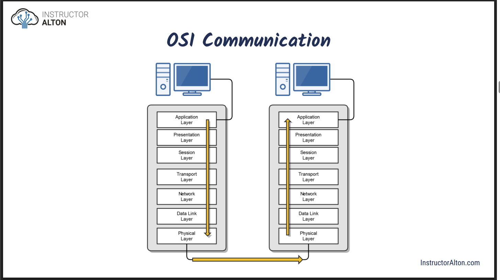
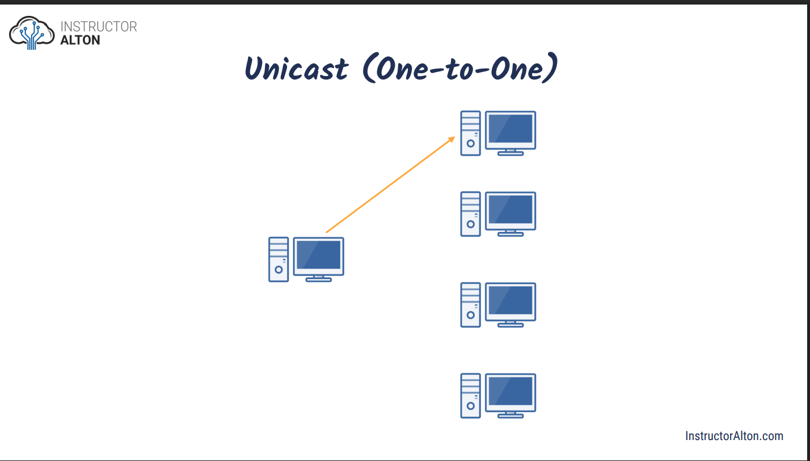
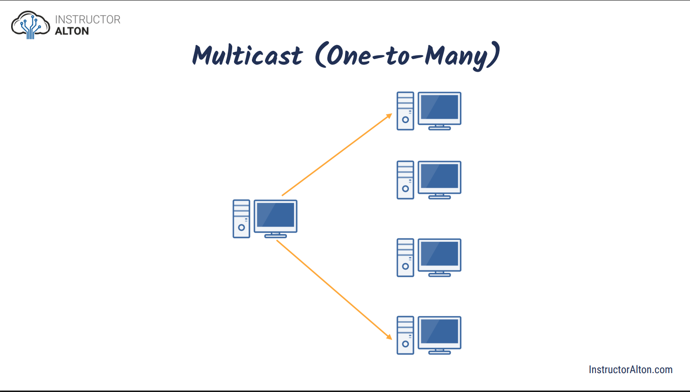
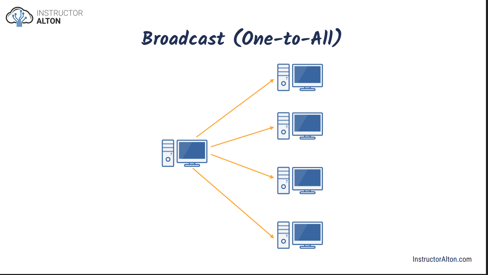
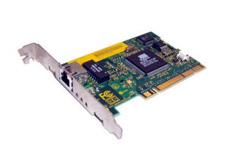

- [Introduction Network](#introduction-network)
  - [Overview and benefit of computer network](#overview-and-benefit-of-computer-network)
    - [What is a Network?](#what-is-a-network)
    - [Some Basic Networking Rules](#some-basic-networking-rules)
    - [Type of Computer Networks (by size)](#type-of-computer-networks-by-size)
    - [Personal Area Network (PAN)](#personal-area-network-pan)
    - [Local Area Network (LAN)](#local-area-network-lan)
    - [Wireless Local Area Network (WLAN)](#wireless-local-area-network-wlan)
    - [Campus Area Network (CAN)](#campus-area-network-can)
    - [Metropolitan Area Network (MAN)](#metropolitan-area-network-man)
    - [Wide Area Network (WAN)](#wide-area-network-wan)
    - [Network Architecture](#network-architecture)
      - [Peer-to-Peer](#peer-to-peer)
      - [Client-Server](#client-server)
    - [Peer-to-Peer vs Client-Server Network](#peer-to-peer-vs-client-server-network)
  - [Introduction to Computer Networking Protocols](#introduction-to-computer-networking-protocols)
  - [Introduction to the OSI Model](#introduction-to-the-osi-model)
    - [What is it?](#what-is-it)
    - [OSI communication](#osi-communication)
  - [Introduction to the TCP/IP Model](#introduction-to-the-tcpip-model)
  - [Duplex Communication](#duplex-communication)
  - [Network Transmission Types](#network-transmission-types)
    - [Unicast](#unicast)
    - [Multicast](#multicast)
    - [Broadcast](#broadcast)
- [Data link layer - OSI layer 2 - TCP/IP Layer 1](#data-link-layer---osi-layer-2---tcpip-layer-1)
  - [MAC Addresses - Media Access Control (MAC)](#mac-addresses---media-access-control-mac)
  - [Ethernet](#ethernet)
- [Network Layer - OSI layer 3 - TCP/IP Layer 2](#network-layer---osi-layer-3---tcpip-layer-2)
  - [IP Address](#ip-address)

# Introduction Network

## Overview and benefit of computer network

### What is a Network?

- It is composed of two main aspects:
  - Physical Connection (wires, cables, wireless media)
  - Logical Connection (data transporting across the physical media)

### Some Basic Networking Rules

- The computers in a network must use the same procedures for sending and receiving data. We call these communication protocols.
- Data must be delivered uncorrupted. If it is corrupted, it’s useless. (There are Exceptions)
- Computers in a network must be capable of determining the origin and destination of a piece of information, i.e., its IP and Mac Address.

### Type of Computer Networks (by size)

- Personal Area Network (PAN)
- Local Area Network (LAN)
- Wireless Local Area Network (WLAN)
- Campus Area Network (CAN)
- Metropolitan Area Network (MAN)
- Wide Area Network (WAN)

### Personal Area Network (PAN)

- Ultra-small networks used for personal use to share
  data from one device to another.
- Examples: Smart Phone to Laptop, Smart Watch to Smart Phone, Heart Rate Monitor to Smart Phone

### Local Area Network (LAN)

- A computer network within a small geographical area, such as a single room, building or group of buildings.
- Examples: Home Network, Small Business or Office Network

### Wireless Local Area Network (WLAN)

- A LAN that’s dependent on wireless connectivity or one that extends a traditional wired LAN to a wireless LAN.
- Most home networks are WLANs.

### Campus Area Network (CAN)

- A computer network of multiple interconnected LANs in a limited geographical area, such as a corporate business park, government agency, or university campus.
- Typically owned or used by a single entity.

### Metropolitan Area Network (MAN)

- A computer network that interconnects users with computer resources in a city.
- Larger than a campus area network, but smaller than a wide area network.

### Wide Area Network (WAN)

- A computer network that extends over a large geographical distance, typically multiple cities, states, or countries.
- WANs connect geographically distant LANs.
- Examples: The Internet, Corporate Offices in Different States

### Network Architecture

#### Peer-to-Peer

- All computers on the network are peers
  - No dedicated servers
  - There’s no centralized control over shared resources
- Any device can share its resources as it pleases
- All computers can act as either a client or a server
- Easy to set-up, and common in homes and small businesse

#### Client-Server

- The network is composed of client and servers
  - Servers provide resources
  - Clients receive resources
- Servers provide centralized control over network resources (files, printers, etc.)
- Centralizes user accounts, security, and access controls to simplify network administration
- More difficult to setup and requires an IT administrator

### Peer-to-Peer vs Client-Server Network

| Criteria                 | Peer-to-Peer (P2P)                           | Client-Server                                           |
| ------------------------ | -------------------------------------------- | ------------------------------------------------------- |
| Computer roles           | All computers are peers                      | Computers are divided into clients and servers          |
| Dedicated servers        | No dedicated servers                         | Dedicated servers                                       |
| Control over resources   | No centralized control                       | Centralized control                                     |
| Resource sharing         | Each device shares resources as it chooses   | Servers provide resources                               |
| Device function          | Any computer can act as a client or a server | Clients request, servers provide                        |
| Resource management      | Decentralized                                | Centralized                                             |
| User accounts & security | No centralized management                    | Centralized user accounts, security, and access control |
| Setup complexity         | Easy to set up                               | More difficult to set up                                |
| IT administration        | Not required                                 | Requires an IT administrator                            |
| Typical usage            | Homes and small businesses                   | Medium and large organizations                          |

## Introduction to Computer Networking Protocols

- Computers communicate with each other with network protocols.
- Protocols are rules governing how machines exchange data and enable effective communication.
- Example Common TCP/IP Suite of Protocols:
  - Web Communication: HTTP
  - E-mail: POP3, SMTP, IMAP
  - File Transfers: FTP

## Introduction to the OSI Model

### What is it?

- The Open Systems Interconnection (OSI) Reference Model

  - A conceptual framework showing us how data moves throughout a network.
  - Developed by the International Organization for Standardization (ISO) in 1977.

- It’s Purpose: Gives us a guide to understanding how networks operate.

**Mnemonic:** _Please Do Not Throw Sausage Pizza Away_

| Layer No. | Mnemonic    | Layer Name   | Data Unit | Common Protocols                              | Typical Devices                   |
| --------- | ----------- | ------------ | --------- | --------------------------------------------- | --------------------------------- |
| 7         | P – Please  | Application  | Data      | HTTP, HTTPS, FTP, SMTP, POP3, IMAP, DNS, SNMP | PC, Server, Proxy Server          |
| 6         | P – Pizza   | Presentation | Data      | SSL/TLS, JPEG, MPEG, ASCII                    | PC, Server                        |
| 5         | S – Sausage | Session      | Data      | NetBIOS Session, RPC, PPTP                    | PC, Server                        |
| 4         | T – Throw   | Transport    | Segment   | TCP, UDP                                      | Firewall, Load Balancer (Layer 4) |
| 3         | N – Not     | Network      | Packet    | IP, ICMP, IPsec, RIP, OSPF, BGP               | Router, Layer 3 Switch            |
| 2         | D – Do      | Data Link    | Frame     | Ethernet (802.3), ARP, PPP, VLAN (802.1Q)     | Switch, Bridge, NIC               |
| 1         | A – Away    | Physical     | Bit       | Physical standards (UTP, Fiber)               | Hub, Repeater, Cable              |

### OSI communication

## Introduction to the TCP/IP Model

- The TCP/IP suite is the most commonly used protocol suite in the networking world.
- It’s essentially the protocol suite in which the Internet was built.
- It’s the standard for computer networking.
- It is based on a 4-layer model that is similar to the OSI model.

| Layer No. | TCP/IP Layer Name | OSI Mapping   | Data Unit   | Common Protocols                              | Typical Devices                   |
| --------- | ----------------- | ------------- | ----------- | --------------------------------------------- | --------------------------------- |
| 4         | Application       | OSI Layer 7–5 | Data        | HTTP, HTTPS, FTP, SMTP, POP3, IMAP, DNS, SNMP | PC, Server, Proxy Server          |
| 3         | Transport         | OSI Layer 4   | Segment     | TCP, UDP                                      | Firewall, Load Balancer (Layer 4) |
| 2         | Internet          | OSI Layer 3   | Packet      | IP, ICMP, IPsec, ARP                          | Router, Layer 3 Switch            |
| 1         | Network Access    | OSI Layer 2–1 | Frame / Bit | Ethernet, Wi-Fi (802.11), PPP                 | Switch, NIC, Hub, Cable           |

## Duplex Communication

- Network communication will occur in either full or half duplex mode:
  - Half Duplex: Can send and receive data, but not at the same time.
  - Full Duplex: Can send and receive data simultaneously.

## Network Transmission Types

### Unicast

- One-to-One

### Multicast

- One-to-Many

### Broadcast

- One-to-All

# Data link layer - OSI layer 2 - TCP/IP Layer 1

## MAC Addresses - Media Access Control (MAC)

- Physical address of the network adapter card
- Represented Hexadecimal - Six bytes (48 bits)
  - First three bytes (24 bits) are assigned by the IEEE to the manufacturer.Organizationally Unique Identifier (OUI) assigned by IEEE (ex: Dell or HP)
  - Last three bytes (24 bits) are usually assigned sequentially: Unique Numbers
- Example MAC address: 00:21:70:6f:06:f2

## Ethernet

- The most popular networking technology in the world!
- Refers to a family of standards that define the physical and logical aspects of the world's most popular type of LAN.
- The standard communications protocol for building a local area network (LAN).

# Network Layer - OSI layer 3 - TCP/IP Layer 2

## IP Address

- An IP Address is a logical address used in order to uniquely identify a device on an IP network
- There are two versions:
  - IP version 4 (IPv4): 192.168.0.1
  - IP version 6 (IPv6): 2001:DB8:85A3:0:0:8A2E:370:7334
