- [Introduction Network](#introduction-network)
  - [Overview and benefit of computer network](#overview-and-benefit-of-computer-network)
    - [What is a Network?](#what-is-a-network)
    - [Some Basic Networking Rules](#some-basic-networking-rules)
    - [Type of Computer Networks (by size)](#type-of-computer-networks-by-size)
      - [Personal Area Network (PAN)](#personal-area-network-pan)
      - [Local Area Network (LAN)](#local-area-network-lan)
      - [Wireless Local Area Network (WLAN)](#wireless-local-area-network-wlan)
      - [Campus Area Network (CAN)](#campus-area-network-can)
      - [Metropolitan Area Network (MAN)](#metropolitan-area-network-man)
      - [Wide Area Network (WAN)](#wide-area-network-wan)
    - [Network Architecture](#network-architecture)
      - [Peer-to-Peer](#peer-to-peer)
      - [Client-Server](#client-server)
      - [Peer-to-Peer vs Client-Server Network](#peer-to-peer-vs-client-server-network)
  - [Introduction to Computer Networking Protocols](#introduction-to-computer-networking-protocols)
    - [What is a Protocol?](#what-is-a-protocol)
    - [Physical and Logical Protocols](#physical-and-logical-protocols)
      - [Physical Protocols](#physical-protocols)
      - [Logical Protocols](#logical-protocols)
  - [The OSI Model](#the-osi-model)
    - [What is the OSI Model?](#what-is-the-osi-model)
    - [The 7 Layers of the OSI Model](#the-7-layers-of-the-osi-model)
    - [How Data Travels Through the OSI Model](#how-data-travels-through-the-osi-model)
    - [OSI Layer 1 — Physical Layer](#osi-layer-1--physical-layer)
      - [What is the Physical Layer?](#what-is-the-physical-layer)
      - [What Does Layer 1 Deal With?](#what-does-layer-1-deal-with)
      - [Physical Network Equipment](#physical-network-equipment)
  - [The TCP/IP Model](#the-tcpip-model)
    - [What is the TCP/IP Model?](#what-is-the-tcpip-model)
    - [The Four Layers of TCP/IP](#the-four-layers-of-tcpip)
    - [TCP/IP vs. OSI Model](#tcpip-vs-osi-model)
    - [Important Protocol Examples](#important-protocol-examples)
  - [Duplex Communication](#duplex-communication)
    - [What is the Duplex Communication?](#what-is-the-duplex-communication)
    - [Half-Duplex](#half-duplex)
  - [Network Transmission Types](#network-transmission-types)
    - [Unicast](#unicast)
    - [Multicast](#multicast)
    - [Broadcast](#broadcast)
  - [Ethernet](#ethernet)
    - [What is Ethernet?](#what-is-ethernet)
    - [Ethernet and the OSI Model](#ethernet-and-the-osi-model)
    - [Ethernet as a Network Access Method](#ethernet-as-a-network-access-method)
  - [Network Topology](#network-topology)
    - [What is Network Topology?](#what-is-network-topology)
    - [Physical Topology](#physical-topology)
    - [Logical Topology](#logical-topology)
    - [Physical vs. Logical](#physical-vs-logical)
  - [Wired Network Topologies](#wired-network-topologies)
    - [Ring Topology](#ring-topology)
    - [Star Topology](#star-topology)
    - [Mesh Topology](#mesh-topology)
      - [Full Mesh](#full-mesh)
      - [Partial Mesh](#partial-mesh)
    - [Ring vs. Star vs. Mesh](#ring-vs-star-vs-mesh)
    - [Hybrid Topology](#hybrid-topology)
  - [Wireless Network Topologies](#wireless-network-topologies)
    - [Ad Hoc Topology](#ad-hoc-topology)
    - [Infrastructure](#infrastructure)
    - [Wireless Mesh Topology](#wireless-mesh-topology)
    - [Comparison](#comparison)
- [Physical - OSI layer 1 - Network Access - TCP/IP Layer 1](#physical---osi-layer-1---network-access---tcpip-layer-1)
  - [Network Interface Card (NIC)](#network-interface-card-nic)
    - [What is a NIC?](#what-is-a-nic)
    - [NIC and MAC Address](#nic-and-mac-address)
    - [A Device Can Have Multiple NICs](#a-device-can-have-multiple-nics)
  - [Hub](#hub)
    - [What is a Hub?](#what-is-a-hub)
    - [Hub and Star Topology](#hub-and-star-topology)
    - [Hub = Multi-Port Repeater](#hub--multi-port-repeater)
    - [Why Are Hubs Bad?](#why-are-hubs-bad)
      - [Network Collisions](#network-collisions)
      - [Security Problem](#security-problem)
  - [Wireless Range Extender - Wi-Fi Repeater](#wireless-range-extender---wi-fi-repeater)
    - [What is a Wireless Range Extender?](#what-is-a-wireless-range-extender)
    - [How Does It Work](#how-does-it-work)
    - [When Would You Use One?](#when-would-you-use-one)
- [Data link - OSI layer 2 - Network Access - TCP/IP Layer 1](#data-link---osi-layer-2---network-access---tcpip-layer-1)
  - [MAC Addresses - Media Access Control (MAC)](#mac-addresses---media-access-control-mac)
    - [What is a MAC Address?](#what-is-a-mac-address)
    - [MAC Address vs. MAC Address Spoofing](#mac-address-vs-mac-address-spoofing)
    - [MAC Address Format](#mac-address-format)
      - [OUI — Organizationally Unique Identifier](#oui--organizationally-unique-identifier)
      - [Individual identifier](#individual-identifier)
  - [Switch](#switch)
    - [What is a Switch?](#what-is-a-switch)
    - [MAC Address Table / CAM Table](#mac-address-table--cam-table)
    - [How a Switch Forwards Data](#how-a-switch-forwards-data)
    - [Collision Domains](#collision-domains)
    - [Security Advantage](#security-advantage)
    - [Broadcast Domain](#broadcast-domain)
    - [Why the switch can still have one large broadcast domain?](#why-the-switch-can-still-have-one-large-broadcast-domain)
    - [Switch vs. Hub](#switch-vs-hub)
  - [Wireless Access Point (WAP)](#wireless-access-point-wap)
    - [What is a Wireless Access Point?](#what-is-a-wireless-access-point)
    - [WAP is NOT a Router](#wap-is-not-a-router)
    - [What Devices Connect to a WAP?](#what-devices-connect-to-a-wap)
- [Network - OSI layer 3 - Internet - TCP/IP Layer 2](#network---osi-layer-3---internet---tcpip-layer-2)
  - [IP Address](#ip-address)
    - [What is an IP Address?](#what-is-an-ip-address)
    - [IP Address vs MAC Address](#ip-address-vs-mac-address)
    - [Internet Protocol version 4 - IPv4](#internet-protocol-version-4---ipv4)
    - [Internet Protocol version 6 - IPv6](#internet-protocol-version-6---ipv6)
  - [Router](#router)
    - [What Does a Router Do?](#what-does-a-router-do)
    - [Router Uses IP Addresses](#router-uses-ip-addresses)
    - [Router vs Switch](#router-vs-switch)
    - [Routers Determine the Best Path](#routers-determine-the-best-path)
    - [A router separates broadcast domains](#a-router-separates-broadcast-domains)
    - [Example](#example)

# Introduction Network

## Overview and benefit of computer network

### What is a Network?

- It is composed of two main aspects:
  - Physical Connection (wires, cables, wireless media)
  - Logical Connection (data transporting across the physical media)

### Some Basic Networking Rules

- The computers in a network must use the same procedures for sending and receiving data. We call these communication protocols.
- Data must be delivered uncorrupted. If it is corrupted, it’s useless. (There are Exceptions)
- Computers in a network must be capable of determining the origin and destination of a piece of information, i.e., its IP and Mac Address.

### Type of Computer Networks (by size)

- Personal Area Network (PAN)
- Local Area Network (LAN)
- Wireless Local Area Network (WLAN)
- Campus Area Network (CAN)
- Metropolitan Area Network (MAN)
- Wide Area Network (WAN)

#### Personal Area Network (PAN)

- Ultra-small networks used for personal use to share
  data from one device to another.
- Examples: Smart Phone to Laptop, Smart Watch to Smart Phone, Heart Rate Monitor to Smart Phone

#### Local Area Network (LAN)

- A computer network within a small geographical area, such as a single room, building or group of buildings.
- Examples: Home Network, Small Business or Office Network

#### Wireless Local Area Network (WLAN)

- A LAN that’s dependent on wireless connectivity or one that extends a traditional wired LAN to a wireless LAN.
- Most home networks are WLANs.

#### Campus Area Network (CAN)

- A computer network of multiple interconnected LANs in a limited geographical area, such as a corporate business park, government agency, or university campus.
- Typically owned or used by a single entity.

#### Metropolitan Area Network (MAN)

- A computer network that interconnects users with computer resources in a city.
- Larger than a campus area network, but smaller than a wide area network.

#### Wide Area Network (WAN)

- A computer network that extends over a large geographical distance, typically multiple cities, states, or countries.
- WANs connect geographically distant LANs.
- Examples: The Internet, Corporate Offices in Different States

### Network Architecture

#### Peer-to-Peer

- All computers on the network are peers
  - No dedicated servers
  - There’s no centralized control over shared resources
- Any device can share its resources as it pleases
- All computers can act as either a client or a server
- Easy to set-up, and common in homes and small businesse

#### Client-Server

- The network is composed of client and servers
  - Servers provide resources
  - Clients receive resources
- Servers provide centralized control over network resources (files, printers, etc.)
- Centralizes user accounts, security, and access controls to simplify network administration
- More difficult to setup and requires an IT administrator

#### Peer-to-Peer vs Client-Server Network

| Criteria                 | Peer-to-Peer (P2P)                           | Client-Server                                           |
| ------------------------ | -------------------------------------------- | ------------------------------------------------------- |
| Computer roles           | All computers are peers                      | Computers are divided into clients and servers          |
| Dedicated servers        | No dedicated servers                         | Dedicated servers                                       |
| Control over resources   | No centralized control                       | Centralized control                                     |
| Resource sharing         | Each device shares resources as it chooses   | Servers provide resources                               |
| Device function          | Any computer can act as a client or a server | Clients request, servers provide                        |
| Resource management      | Decentralized                                | Centralized                                             |
| User accounts & security | No centralized management                    | Centralized user accounts, security, and access control |
| Setup complexity         | Easy to set up                               | More difficult to set up                                |
| IT administration        | Not required                                 | Requires an IT administrator                            |
| Typical usage            | Homes and small businesses                   | Medium and large organizations                          |

## Introduction to Computer Networking Protocols

### What is a Protocol?

- A protocol is essentially a set of rules that defines how systems communicate and exchange data.
- In computer networking, network protocols are rules that govern how devices on a network exchange data and enable effective communication.
- Examples:
  - Email protocols => sending and receiving emails
    - POP3, SMTP, IMAP
  - File transfer protocols => sending and receiving files
    - FTP
  - Web protocols => communicating with web servers 
    - HTTP, HTTPS

### Physical and Logical Protocols

- A computer network has two main aspects:
  - Physical aspect
  - Logical aspect
- Therefore, networking protocols can also be divided into

#### Physical Protocols

- Physical protocols deal with the physical characteristics of network communication, such as:
  - Network transmission media
  - Cables and wiring
  - Connectors
  - RJ-45 ports
  - Electrical signals
  - Voltage levels on the wire

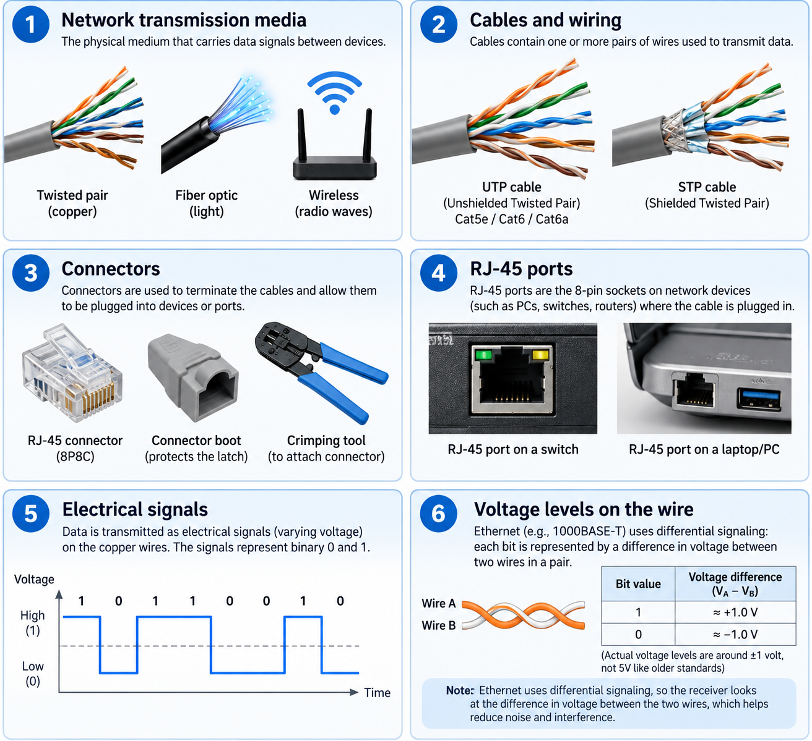

#### Logical Protocols

- Logical protocols deal with software and communication rules.
- They determine:
  - How data is sent
  - When data is sent
  - How data is received
  - How computers communicate using the underlying physical network

## The OSI Model

### What is the OSI Model?

- OSI stands for Open Systems Interconnection.
- The OSI model is a conceptual reference model that explains how data flows through a network from a source device to a destination device.
- Important:
  - OSI is not actually implemented as the networking architecture used in the real world.
  - TCP/IP is the practical networking model/protocol suite used in real networks.
  - However, OSI is widely used for learning, troubleshooting, and discussing networking concepts.

### The 7 Layers of the OSI Model

**Memorize:** _Please Do Not Throw Sausage Pizza Away_

| Layer No. | Mnemonic    | Layer Name   | Data Unit | Common Protocols                              | Typical Devices                   |
| --------- | ----------- | ------------ | --------- | --------------------------------------------- | --------------------------------- |
| 7         |  A – Away | Application  | Data      | HTTP, HTTPS, FTP, SMTP, POP3, IMAP, DNS, SNMP | PC, Server, Proxy Server          |
| 6         | P – Pizza   | Presentation | Data      | SSL/TLS, JPEG, MPEG, ASCII                    | PC, Server                        |
| 5         | S – Sausage | Session      | Data      | NetBIOS Session, RPC, PPTP                    | PC, Server                        |
| 4         | T – Throw   | Transport    | Segment   | TCP, UDP                                      | Firewall, Load Balancer (Layer 4) |
| 3         | N – Not     | Network      | Packet    | IP, ICMP, IPsec, RIP, OSPF, BGP               | Router, Layer 3 Switch            |
| 2         | D – Do      | Data Link    | Frame     | Ethernet (802.3), ARP, PPP, VLAN (802.1Q)     | Switch, Bridge, NIC               |
| 1         | P – Please    | Physical     | Bit       | Physical standards (UTP, Fiber)               | Hub, Repeater, Cable              |

### How Data Travels Through the OSI Model

- Sender: The data starts at the top

```
  Application
     ↓
  Presentation
     ↓
  Session
     ↓
  Transport
     ↓
  Network
     ↓
  Data Link
     ↓
  Physical
     ↓
   Network
```

- Receiver: Receives the transmission and processes it in the opposite direction

```
   Network
      ↓
  Physical
      ↓
  Data Link
      ↓
  Network
      ↓
  Transport
      ↓
  Session
      ↓
  Presentation
      ↓
  Application
```

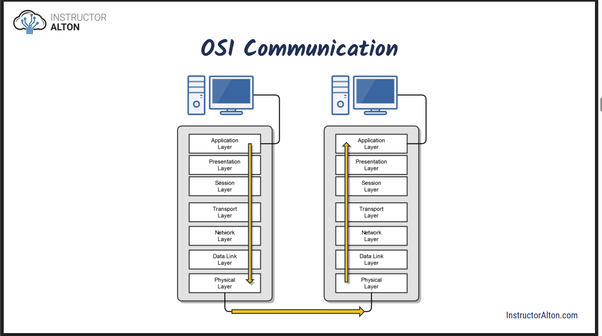

### OSI Layer 1 — Physical Layer

#### What is the Physical Layer?

- The Physical Layer is Layer 1, the lowest layer of the OSI model.
- Its main purpose is to define how raw bits are physically transmitted between network devices.
- At this layer: **Frames (Data Link Layer) are converted into bits (0s and 1s) for physical transmission.**

#### What Does Layer 1 Deal With?

- The Physical Layer deals with the physical and electrical characteristics of network communication.
- It includes:
  - Network hardware
  - Physical media
  - Physical topology
  - Signals used to transmit bits

- Three main types of physical signals

| Medium           | Signal             |
| ---------------- | ------------------ |
| **Copper cable** | Electrical signals |
| **Fiber optic**  | Light photons      |
| **Wireless**     | Radio waves        |

#### Physical Network Equipment

- Layer 1 includes simple physical equipment that generally doesn't make intelligent networking decisions.
- Examples:
  - Cables
  - Network jacks
  - Patch panels
  - Hubs
  - Media converters
  - Modems

## The TCP/IP Model

### What is the TCP/IP Model?

- TCP/IP is the most widely used networking protocol suite today and forms the foundation of the Internet.
- Unlike the OSI model:
  - OSI => conceptual/reference model, never implemented as a real-world networking architecture.
  - TCP/IP => actually implemented and widely used in real network

### The Four Layers of TCP/IP

| Layer No. | TCP/IP Layer Name | OSI Mapping   | Data Unit   | Common Protocols                              | Typical Devices                   |
| --------- | ----------------- | ------------- | ----------- | --------------------------------------------- | --------------------------------- |
| 4         | Application       | OSI Layer 7–5 | Data        | HTTP, HTTPS, FTP, SMTP, POP3, IMAP, DNS, SNMP | PC, Server, Proxy Server          |
| 3         | Transport         | OSI Layer 4   | Segment     | TCP, UDP                                      | Firewall, Load Balancer (Layer 4) |
| 2         | Internet          | OSI Layer 3   | Packet      | IP, ICMP, IPsec, ARP                          | Router, Layer 3 Switch            |
| 1         | Network Access    | OSI Layer 2–1 | Frame / Bit | Ethernet, Wi-Fi (802.11), PPP                 | Switch, NIC, Hub, Cable           |

### TCP/IP vs. OSI Model

- TCP/IP didn't completely change how networking functions work.
- Instead, it simplified the OSI model by combining related functions into fewer layers

| TCP/IP                | OSI                                  |
| --------------------- | ------------------------------------ |
| **Application**       | Application + Presentation + Session |
| **Transport**         | Transport                            |
| **Internet**          | Network                              |
| **Network Interface** | Data Link + Physical                 |

```
TCP/IP Model                  OSI Model

Application        ───────>   Application
                              Presentation
                              Session

Transport          ───────>   Transport

Internet           ───────>   Network

Network Interface  ───────>   Data Link
                              Physical
```

### Important Protocol Examples

| Layer                       | Protocol / Technology | Purpose                                                              |
| --------------------------- | --------------------- | -------------------------------------------------------------------- |
| **Application Layer**       | **HTTP/HTTPS**        | Web communication                                                    |
| **Application Layer**       | **FTP**               | File transfer                                                        |
| **Application Layer**       | **SMTP**              | Sending email                                                        |
| **Application Layer**       | **POP3**              | Receiving email                                                      |
| **Transport Layer**         | **TCP**               | Reliable transport of data                                           |
| **Transport Layer**         | **UDP**               | Fast, connectionless transport of data                               |
| **Internet Layer**          | **IP**                | Logical addressing and routing                                       |
| **Internet Layer**          | **ARP**               | Resolving IP addresses to MAC addresses in IPv4 networks             |
| **Network Interface Layer** | **Ethernet**          | Accessing the network and transmitting data over Ethernet networks   |
| **Network Interface Layer** | **Token Ring**        | Accessing the network and transmitting data over Token Ring networks |


## Duplex Communication

### What is the Duplex Communication?

- Duplex describes how devices send and receive data over a communication channel.
- There are two modes:
  - Half-duplex
  - Full-duplex

### Half-Duplex

- With half-duplex, a device can send or receive data, but not both at the same time.

```
PC 1 ─────────→ PC 2
     Sending

PC 1 ←───────── PC 2
     Receiving
```

## Network Transmission Types

- Network transmission type describes the general way data is sent from one system to other systems on a network.

- There are three basic types:

| Type          | Communication   | Description                                            |
| ------------- | --------------- | ------------------------------------------------------ |
| **Unicast**   | **One-to-One**  | One sender sends data to one specific receiver         |
| **Multicast** | **One-to-Many** | One sender sends data to a specific group of receivers |
| **Broadcast** | **One-to-All**  | One sender sends data to all devices on the network    |


### Unicast

- One-to-One
- Only one specific device receives the data.

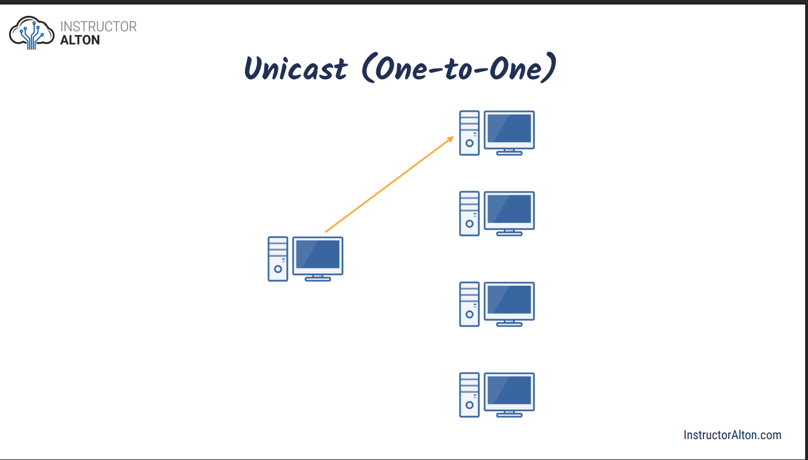

### Multicast

- One-to-Many
- The sender sends data to a specific group of devices, called a multicast group.

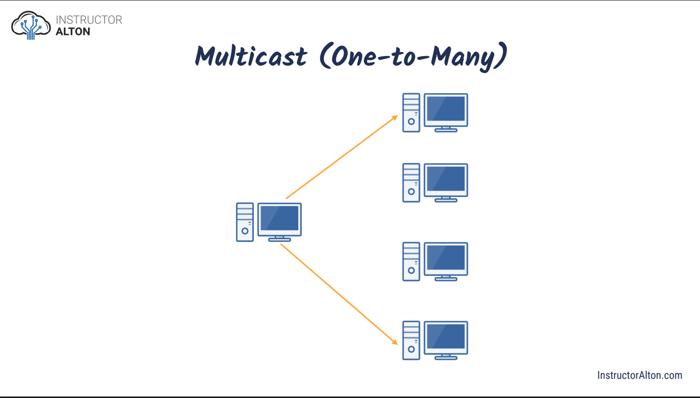

### Broadcast

- One-to-All
- The sender sends data to all devices on the relevant network.

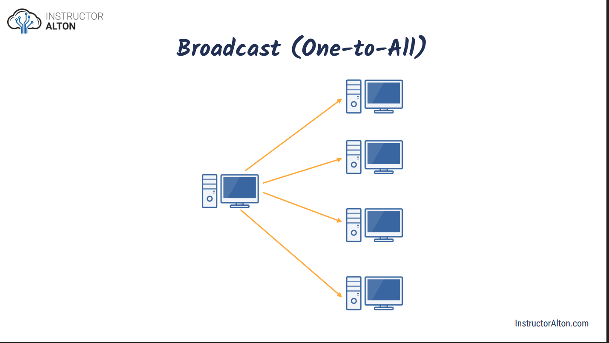

## Ethernet

### What is Ethernet?

- Ethernet is a family of networking standards used primarily for communication within **Local Area Networks (LANs)**.
- It covers both:
  - Physical aspects of networking 
  - Logical/data communication aspects
- So Ethernet is not just about cables.

### Ethernet and the OSI Model

- Ethernet is associated with both:
  - Layer 1 — Physical: Ethernet defines physical aspects such as
    - Network cables
    - Connectors
    - Electrical signals
    - Physical transmission
  - Layer 2 — Data Link: Ethernet also defines aspects of how data moves across the local network, including:
    - Frames
    - MAC addresses
    - Access to the shared network medium
- Therefore: thernet operates across OSI Layer 1 and Layer 2.

### Ethernet as a Network Access Method

- Ethernet provides rules for how devices access and communicate over the network medium.
- The lecture introduces CSMA: **Carrier Sense Multiple Access**
  - The idea is that devices can sense the communication medium before transmitting

## Network Topology

### What is Network Topology?

- Network Topology can be thought of as a blueprint of a network.
- A Network has two aspects:
  - Physical
  - Logical
Therefore, we have: **Physical topology** and **Logical topology**

### Physical Topology

- Physical topology describes where devices are physically located and how they are physically connected.
- It includes:
  - Servers
  - Switches
  - Routers
  - Firewalls
  - Printers
  - Network cables
  - Physical connections

- Example

```
          Router
             │
          Switch
        ┌────┼────┐
       PC   Server Printer
```

### Logical Topology

- Logical topology describes how data flows through the network.
- It isn't primarily concerned with where the devices physically sit. Instead, it focuses on the rules and protocols that determine how data is transmitted.
- Examples include:
  - Ethernet
  - CSMA/CD
  - IEEE 802.11
  - CSMA/CA

### Physical vs. Logical

|                | **Physical Topology**                     | **Logical Topology**        |
| -------------- | ----------------------------------------- | --------------------------- |
| Focus          | Physical connections                      | Data flow                   |
| Describes      | Where/how devices are connected           | How devices communicate     |
| Examples       | Cables, switches, routers                 | Ethernet, 802.11, CSMA/CD   |
| Think of it as | **Physical blueprint**                    | **Communication blueprint** |
| Main question  | "How is everything physically connected?" | "How does data flow?"       |


## Wired Network Topologies

### Ring Topology

- In a ring topology, every device (node) is connected to two other devices, forming a closed loop.

```
       PC1
      /   \
    PC2   PC6
    |       |
    PC3   PC5
      \   /
       PC4
```

- How does data travel?
  - Data moves from node to node around the ring.
  - Each device can regenerate/repeat the signal before passing it to the next device.
- Problem with traditional ring
  - If one device or cable fails -> The ring can be broken, preventing communication.
- Modern ring topology
  - Modern implementations can use two counter-rotating rings
  - If one path fails, traffic can use the other path.
  - This provides: Redundancy- High availability- Rapid recovery from failures
  - Examples mentioned: SONET- SDH- Metro Ethernet

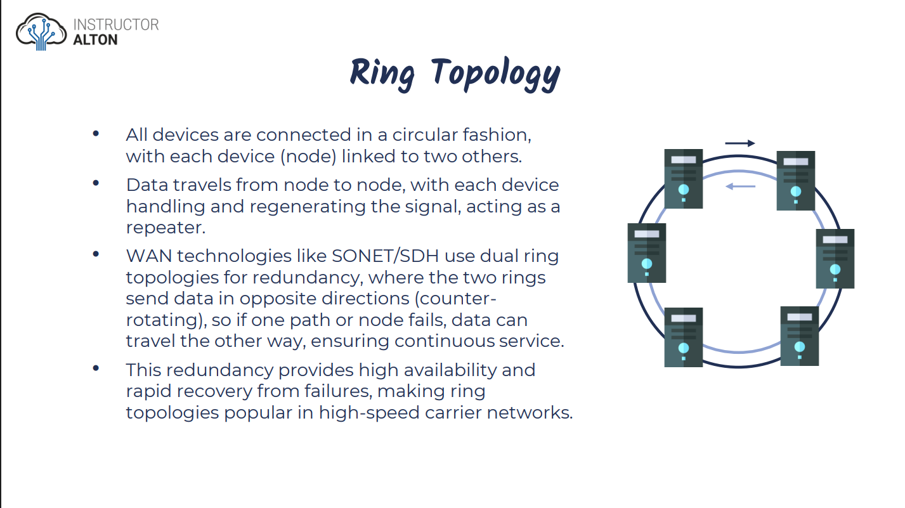

### Star Topology

- In a star topology, all devices connect to a central device, typically a switch.

```
           PC
            │
            │
PC ─────── Switch ───── Server
            │
            │
         Printer
```

- How does it work?
  - Devices send their data to the central switch.
  - The switch determines the destination and forwards the data to the appropriate device.
- Advantages
  - Simple to manage
  - Easy to expand
  - Easy to troubleshoot
  - Standard topology for modern LANs
- Disadvantage
  - The central switch can be a single point of failure

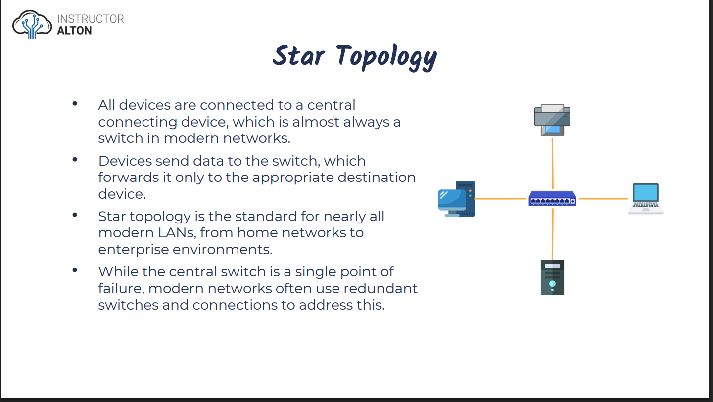

### Mesh Topology

- In a mesh topology, devices have multiple connections, creating redundant paths.
- There are two main types:
  - Full mesh
  - Partial mesh

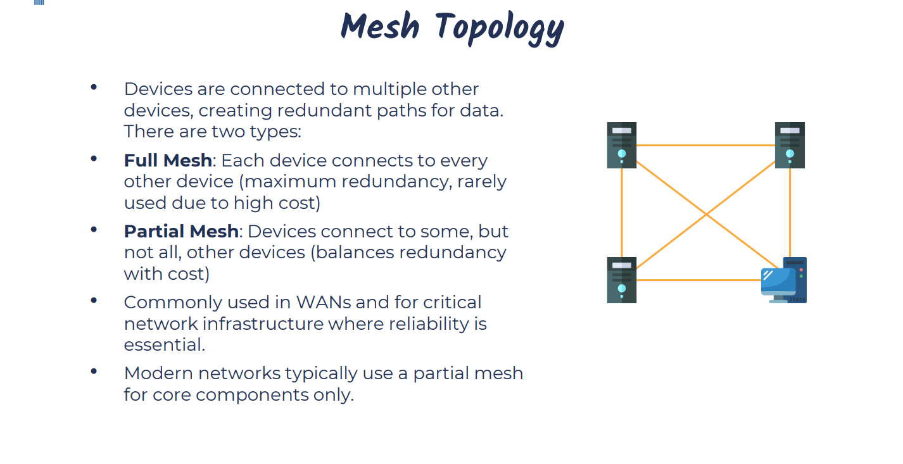

#### Full Mesh

- In a full mesh, every device connects directly to every other device.
- The exact number of connections grows very quickly as more devices are added
- For n devices, the number of links is: `n(n − 1) / 2`
- For example:
  - 3 devices -> 3 links
  - 10 devices -> 45 links
  - 20 devices -> 190 links
  - 50 devices -> 1,225 links

```
      S1
     / | \
    /  |  \
  S2───┼───S3
   \   |   /
    \  |  /
      D1
```

#### Partial Mesh

- In a partial mesh, devices connect to some, but not all, other devices.
- Some devices have multiple paths, while others may have only one path.
- Main advantage
  - It provides a balance between: **Redundancy <-> Cost**
  - Therefore, partial mesh is much more practical for real-world networks.

### Ring vs. Star vs. Mesh

| Topology         | Structure                             | Main Advantage               | Main Disadvantage       | Common Use              |
| ---------------- | ------------------------------------- | ---------------------------- | ----------------------- | ----------------------- |
| **Ring**         | Devices form a loop                   | Redundancy with dual rings   | More complex            | Carrier/WAN networks    |
| **Star**         | Devices connect to central switch     | Simple & easy to manage      | Central device can fail | Modern LANs             |
| **Full Mesh**    | Every device connects to every device | Maximum redundancy           | Very expensive          | Critical infrastructure |
| **Partial Mesh** | Devices connect to selected devices   | Good redundancy/cost balance | More complex than star  | Core/WAN networks       |

### Hybrid Topology

- Real-world networks usually don't use only one topology.
- They commonly combine different topologies
- For example
  - The core might use a partial mesh for redundancy, while devices at the edge connect using a star topology.
  - This combination is called a Hybrid topology

```
              Core
          ┌─────┴─────┐
       Switch        Switch
       /   \          /   \
     PC    PC       PC    Server
```

## Wireless Network Topologies

### Ad Hoc Topology

- An **Ad Hoc network** is a **peer-to-peer (P2P)** wireless network.
- There is no central wireless **access point (AP)**.
- Devices communicate directly with one another.
- Characteristics
  - No central AP
  - Device-to-device communication
  - Simple to set up
  - Suitable for small/personal networks
  - Can be considered a type of peer-to-peer wireless communication

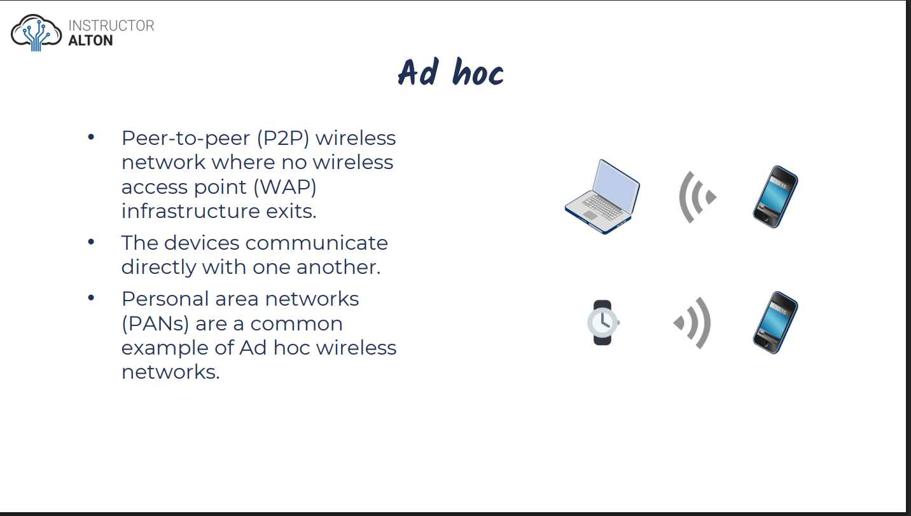

### Infrastructure

- This is the most common traditional wireless network design.
- Devices connect to a Wireless Access Point (WAP/AP)
- A typical infrastructure WLAN is not completely wireless
  - The wireless devices communicate with the AP wirelessly, but the AP normally has a wired connection to the rest of the network.
- Characteristics
  - Uses a central Wireless Access Point
  - Common in homes and businesses
  - Forms a WLAN (Wireless LAN)
  - Easy to manage
  - **Infrastructure = Devices → AP → Wired Network**

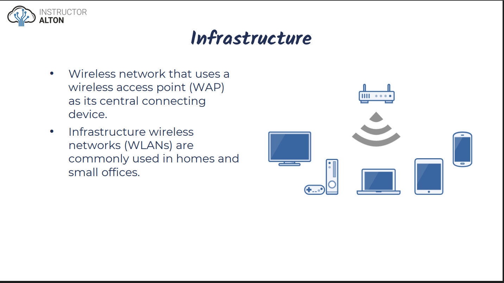

### Wireless Mesh Topology

- A wireless mesh network uses multiple wireless nodes/APs that communicate with one another.

```
             Node
            /    \
           /      \
Wired → Node ───── Node
           \      /
            \    /
             Node
```

- For example, if one node fails
  - Other nodes can potentially provide an alternative path
  - The network may lose some coverage or performance, but it doesn't necessarily go down completely.

```
Node A ─── ❌ Node B
   \              /
    └── Node C ──┘
```

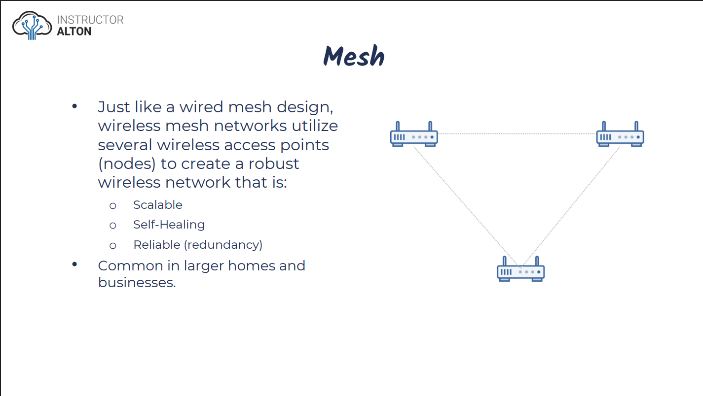

### Comparison

|                      | **Ad Hoc**   | **Infrastructure**   | **Wireless Mesh**      |
| -------------------- | ------------ | -------------------- | ---------------------- |
| Central AP           | ❌            | ✅                    | Usually multiple nodes |
| Device communication | Direct       | Through AP           | Through mesh nodes     |
| Scale                | Small        | Small → Large        | Medium → Large         |
| Coverage             | Limited      | AP-dependent         | Large                  |
| Redundancy           | Low          | Usually low          | **High**               |
| Self-healing         | ❌            | ❌                    | **✅**                  |
| Common use           | P2P/personal | Home & business WLAN | Large homes/businesses |


# Physical - OSI layer 1 - Network Access - TCP/IP Layer 1

## Network Interface Card (NIC)

### What is a NIC?

- A Network Interface Card (NIC) is a hardware component that allows a device to connect and communicate with a network.
- Other terms for NIC include:
  - Network Interface Card
  - NIC
  - Network Adapter
- If a device needs to communicate on a network, it needs at least one network interface.

### NIC and MAC Address

- Each NIC has a unique MAC address associated with it.

```
NIC
 └── MAC Address
       ↓
   Unique identifier
```

- The MAC address is associated with the network interface hardware.
- Although the operating system can spoof the MAC address, that does not physically change the hardware's original address

### A Device Can Have Multiple NICs

- A computer does not have to have only one NIC.
- Example
  - Each network interface can have its own: MAC address, IP address

```
# A modern desktop might have

Desktop
 ├── Ethernet NIC
 │     └── RJ-45
 │
 └── Wi-Fi NIC
       └── Radio
```

```
# Servers commonly have multiple network interfaces

Server
 ├── NIC 1 → Network A
 └── NIC 2 → Network B
```

## Hub

### What is a Hub?

- A hub is a legacy networking device that was commonly used in older networks.
- Today, hubs have been almost completely replaced by switches.
- A hub and a switch may look physically similar, but they operate very differently internally.
  - Hub = Dumb device
  - Switch = Smart device

### Hub and Star Topology

- A hub can act as the central connecting device in a star topology.

```
# All devices connect to the hub.

          PC1
           │
PC2 ───── HUB ───── PC3
           │
          PC4

```

### Hub = Multi-Port Repeater

- A hub is essentially a multi-port repeater.
  - When data enters one port, the hub repeats it out through all other connected ports.
- For example
  - Even if PC1 only wants to communicate with PC4, the hub sends the signal to PC2, PC3, and PC4.
  - PC2 and PC3 will receive the signal and determine that the data isn't intended for them, so they discard it.

```
PC1 ──> HUB ──> PC2
             ├─> PC3
             └─> PC4
```

### Why Are Hubs Bad?

#### Network Collisions

- Because the hub sends traffic to every port, all connected devices share the same communication medium.
  - This creates a collision.
  - The larger the network, the greater the potential for collisions.

#### Security Problem

- Hubs can also create security concerns.
  - Because traffic is repeated out to every port
  - Other devices may receive traffic that wasn't intended for them.
  - A switch, on the other hand, can make forwarding decisions based on MAC addresses, so traffic can normally be sent only toward the appropriate destination port.

## Wireless Range Extender - Wi-Fi Repeater

### What is a Wireless Range Extender?

- A Wireless Range Extender is a device that extends the coverage/range of an existing Wi-Fi network.
- It works similarly to a repeater
  - The extender receives the wireless signal from the WAP and rebroadcasts it to areas where the original signal is weak.

### How Does It Work

- So the extender does not create a completely new network connection. 
- It mainly repeats/rebroadcasts the existing wireless signal.

```
Wireless Access Point
        │
        │ Wi-Fi signal
        ▼
[Range Extender]
        │
        │ Re-broadcast
        ▼
  Extended Wi-Fi Area
```

### When Would You Use One?

- A range extender is useful when
  - Your house is large.
  - Your office has areas with weak Wi-Fi.
  - Some rooms are outside the WAP's effective coverage.
  - There is radio-frequency interference.
  - You have multiple floors.

# Data link - OSI layer 2 - Network Access - TCP/IP Layer 1

## MAC Addresses - Media Access Control (MAC)

### What is a MAC Address?

- MAC stands for Media Access Control.
- A MAC address is the physical/hardware address associated with a device's **network adapter**.
- A network adapter is also called:
  - Network Interface Card (NIC)
  - Network Adapter
  - These terms are generally interchangeable

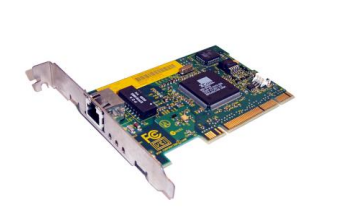

### MAC Address vs. MAC Address Spoofing

- Traditionally, a MAC address is assigned to the network interface hardware.
- It is associated with the hardware rather than being simply an IP address configured by the user.
- However, an operating system can perform MAC address spoofing.
  - The hardware's original MAC address isn't physically changed. Instead, the operating system is instructed to use a different MAC address.
  - MAC spoofing is also relevant in cybersecurity and network testing.

### MAC Address Format

- A MAC address is: 48 bits - 6 bytes
  - Usually represented in hexadecimal
  - Example: 00:1A:2B:3C:4D:5E

```
00 : 1A : 2B : 3C : 4D : 5E
 └───────┘   └───────────────┘
   3 bytes         3 bytes
  (24 bits)       (24 bits)
    |                 |
    ▼                 ▼
   OUI       Individual identifier
```

#### OUI — Organizationally Unique Identifier

- OUI stands for Organizationally Unique Identifier.
- The OUI identifies the organization/manufacturer associated with the network interface.
- OUIs are assigned through the IEEE
  - Institute of Electrical and Electronics Engineers

#### Individual identifier

- The remaining 24 bits can be used to identify individual network interfaces under that OUI.
- 2²⁴ ~16.7 Million Unique Addresses

## Switch

### What is a Switch?

- A switch is a network device used to connect multiple devices in a LAN (Local Area Network).
- Like a hub, a switch can act as the central connecting device in a star topology.
  - Although a hub and switch may look similar physically, they work very differently internally.

```
          PC1
           │
PC2 ──── Switch ──── PC3
           │
          PC4
```

### MAC Address Table / CAM Table

- A switch learns the MAC addresses of connected devices and stores them in a table.
- This table can be called:
  - MAC address table
  - CAM table (CAM = Content Addressable Memory)

### How a Switch Forwards Data

```
PC1 ──> Switch ──> MAC Address Table -> MAC Destination -> Port -> PC4
```

- Suppose PC1 wants to send data to PC4.
  - The switch checks its MAC/CAM table: `PC4's MAC → Port 4`
  - Therefore, it forwards the frame only through Port 4.
  - Another devices don't receive the frame

### Collision Domains

- One of the biggest advantages of a switch is that it breaks up collision domains.
- **Hub**: A hub creates essentially one large collision domain
- **Switch**: With a switch, each switch port represents a separate collision domain in the traditional Ethernet model

### Security Advantage

- Switches are also more secure than hubs.
- Remember
  - A switch does not automatically make a network completely secure. 
  - There are techniques such as MAC flooding, port mirroring, ARP spoofing, etc., that can affect Layer 2 security.

| **Hub**                                                                                                                    | **Switch**                                                                 |
| -------------------------------------------------------------------------------------------------------------------------- | -------------------------------------------------------------------------- |
| Because the hub **repeats the signal to every port**, another device connected to the hub may potentially capture traffic. | The switch normally **forwards the frame only toward the appropriate por** |


### Broadcast Domain

- A switch does NOT normally break up a broadcast domain.
- Example

```
# For example, if PC3 sends a broadcast
# The broadcast can be forwarded to the other ports.

              ┌──→ PC1
              ├──→ PC2
PC3 → SWITCH ─┼──→ PC4
              └──→ PC5
```

- Therefore: **A basic Layer 2 switch = multiple collision domains but one broadcast domain.**

### Why the switch can still have one large broadcast domain?

- When a new computer joins a network, it may not have an IP address yet.
  - It can send **a DHCP broadcast** asking: "Is there a DHCP server that can give me an IP address?"
  - The switch can forward this broadcast within the LAN.

```
PC
 │
 │ DHCP Broadcast
 ↓
Switch
 │
 ├──→ Other devices
 │
 └──→ DHCP Server
```

- This is why the switch can still have **one large broadcast domain**, even though it has **multiple collision domains**

### Switch vs. Hub

- The most important difference:
  - Hub -> repeats traffic everywhere
  - Switch -> intelligently forwards traffic to the destination

|                    | **Hub**         | **Switch**           |
| ------------------ | --------------- | -------------------- |
| OSI Layer          | **Layer 1**     | **Layer 2**          |
| Type               | Dumb device     | Intelligent device   |
| Main function      | Repeats signals | Forwards frames      |
| Uses MAC addresses | ❌               | ✅                    |
| Traffic            | To all ports    | To destination port  |
| Collision domains  | **1 large**     | **Multiple smaller** |
| Modern LANs        | Legacy          | **Standard**         |

## Wireless Access Point (WAP)

### What is a Wireless Access Point?

- A Wireless Access Point (WAP) is a dedicated network device that bridges a wired network to a wireless network.

```
Wired Network
     │
     │ Ethernet cable
     ▼
   [ WAP ]
   /  |  \
  /   |   \
Wi-Fi Wi-Fi Wi-Fi
 PC  Phone  Tablet
```

### WAP is NOT a Router

| Device          | Main Function                                               |
| --------------- | ----------------------------------------------------------- |
| **WAP**         | Bridges wired network ↔ wireless network                    |
| **Router**      | Connects different IP networks and performs Layer 3 routing |
| **SOHO device** | Usually combines router + switch + WAP + other functions    |


### What Devices Connect to a WAP?

- A WAP allows many wireless devices to connect to the network:
  - Smartphones
  - Laptops
  - Tablets
  - IoT devices
  - Smart speakers
  - Smart lights
  - Smart plugs
  - Smart refrigerators
  - Smart garage doors
  - Other wireless devices


# Network - OSI layer 3 - Internet - TCP/IP Layer 2

## IP Address

### What is an IP Address?

- IP stands for Internet Protocol.
- An IP address is a logical address used to identify a device on a network.
- Unlike a MAC address, an IP address is configured by the operating system/network configuration.
  - It can be assigned in two main ways:
    - Automatically -> using DHCP
    - Manually -> Manually configured. The administrator enters the IP address.
- Example
  - Pv4 - 192.168.1.10
  - IPv6 - 2001:db8::1

### IP Address vs MAC Address

| **Category**                 | **IP Address**                                                                                         | **MAC Address**                                                                                              |
| ---------------------------- | ------------------------------------------------------------------------------------------------------ | ------------------------------------------------------------------------------------------------------------ |
| **Definition**               | A **logical address**                                                                                  | A **physical/hardware address** associated with a network interface card (NIC)                               |
| **OSI Layer**                | **Layer 3 — Network Layer**                                                                            | **Layer 2 — Data Link Layer**                                                                                |
| **Main Purpose**             | Used for **network-to-network communication**, especially when traffic needs to travel through routers | Used primarily for **communication within a local network (LAN)**                                            |
| **Communication**            | **Network → Network**                                                                                  | **Device/interface → Device/interface within a local network**                                               |
| **Main Network Device**      | **Router**                                                                                             | **Switch**                                                                                                   |
| **Assignment**               | **Static** or **Dynamic**                                                                              | Associated with the **NIC hardware**                                                                         |
| **Static Assignment**        | Manually configured by a network administrator                                                         | Normally associated with the network interface hardware                                                      |
| **Dynamic Assignment**       | Automatically assigned by a **DHCP server**                                                            | Not normally assigned by DHCP                                                                                |
| **Can be spoofed?**          | Yes                                                                                                    | Yes — the OS can spoof a MAC address, but this does not physically change the address stored by the hardware |
| **Example**                  | `192.168.1.10`                                                                                         | `00:1A:2B:3C:4D:5E`                                                                                          |
| **Example of communication** | Your home network → Router → Internet → Gmail network → Gmail server                                   | PC → Switch → PC / Printer                                                                                   |
| **Key concept**              | **Routing**                                                                                            | **Switching**                                                                                                |

### Internet Protocol version 4 - IPv4

### Internet Protocol version 6 - IPv6


## Router

### What Does a Router Do?

- A router connects different networks together.
- This is the key difference:
  - Switch → connects devices within the same network
  - Router → connects different networks

- Example: If PC1 wants to communicate with PC3, they are on different networks, so the traffic must pass through the router.

```
Network A                              Network B
192.168.1.0/24                         192.168.2.0/24

 PC1 ──┐                              ┌── PC3
       │                              │
    [Switch]                        [Switch]
       │                              │
 PC2 ──┘                              └── PC4
       │                              │
       ↓                              ↓
   [Router A] ──────────────── [Router B]
       │        Network Link        │
       └────────────────────────────┘
```

### Router Uses IP Addresses

- A router operates primarily at: **OSI Layer 3 — Network Layer**
- It uses **IP addresses** to determine where packets should go.

| Device | OSI Layer | Main Address | Main Function                  |
| ------ | --------: | ------------ | ------------------------------ |
| Hub    |   Layer 1 | —            | Repeat signals                 |
| Switch |   Layer 2 | **MAC**      | Forward frames within LAN      |
| Router |   Layer 3 | **IP**       | Route packets between networks |

### Router vs Switch

- **Switch**: "Which port is this MAC address connected to?"

```
# Same Network

PC1 ─── Switch ─── PC2
       MAC address
```

- **Router**: "Which network should I send this IP packet toward?"

```
# Different Networks

PC1 ─── Switch ─── Router ─── Switch ─── PC2
                  IP address
```

### Routers Determine the Best Path

- The routers determine an appropriate/best route toward the destination based on their routing information

### A router separates broadcast domains

- A router therefore creates a boundary between different Layer 3 networks/broadcast domains.

```
 Broadcast Domain A
 PC1 ── Switch ──┐
                 │
              [Router]
                 │
                 └── Switch ── PC3
                     Broadcast Domain B
```

### Example

```
# When PC1 wants to communicate with PC3:

PC1
Network: 192.168.1.0/24

        ↓

[Switch]

        ↓

[Router]

        ↓

[Switch]

        ↓

PC3
Network: 192.168.2.0/24
```

- Step 1 — PC1 sends the frame
  - PC1 sends traffic toward the router through the local switch.
- Step 2 — Switch forwards using MAC
  - The switch examines the destination MAC address and uses its CAM/MAC table to determine the correct port.
- Step 3 — Router receives the packet
  - The router examines the destination IP address
- Step 4 — Router chooses the route
  - The router checks its routing information and determines where to forward the packet.
- Step 5 — Destination network
  - Eventually the packet reaches the destination network.
  - The destination switch then uses MAC addresses to deliver the frame to PC3