- [Introduction Network](#introduction-network)
  - [Overview and benefit of computer network](#overview-and-benefit-of-computer-network)
    - [What is a Network?](#what-is-a-network)
    - [Some Basic Networking Rules](#some-basic-networking-rules)
    - [Type of Computer Networks (by size)](#type-of-computer-networks-by-size)
      - [Personal Area Network (PAN)](#personal-area-network-pan)
      - [Local Area Network (LAN)](#local-area-network-lan)
      - [Wireless Local Area Network (WLAN)](#wireless-local-area-network-wlan)
      - [Campus Area Network (CAN)](#campus-area-network-can)
      - [Metropolitan Area Network (MAN)](#metropolitan-area-network-man)
      - [Wide Area Network (WAN)](#wide-area-network-wan)
    - [Network Architecture](#network-architecture)
      - [Peer-to-Peer](#peer-to-peer)
      - [Client-Server](#client-server)
      - [Peer-to-Peer vs Client-Server Network](#peer-to-peer-vs-client-server-network)
  - [Introduction to Computer Networking Protocols](#introduction-to-computer-networking-protocols)
    - [What is a Protocol?](#what-is-a-protocol)
    - [Physical and Logical Protocols](#physical-and-logical-protocols)
      - [Physical Protocols](#physical-protocols)
      - [Logical Protocols](#logical-protocols)
- [How Computer Networks Work?](#how-computer-networks-work)
  - [The OSI Model](#the-osi-model)
    - [What is the OSI Model?](#what-is-the-osi-model)
    - [The 7 Layers of the OSI Model](#the-7-layers-of-the-osi-model)
    - [How Data Travels Through the OSI Model](#how-data-travels-through-the-osi-model)
    - [Encapsulation \& De-encapsulation](#encapsulation--de-encapsulation)
      - [What is Encapsulation?](#what-is-encapsulation)
        - [Encapsulation Process](#encapsulation-process)
        - [De-encapsulation process](#de-encapsulation-process)
    - [OSI Layer 7 — Application Layer](#osi-layer-7--application-layer)
      - [Overview](#overview)
      - [What happens at the Application Layer?](#what-happens-at-the-application-layer)
      - [Application vs. Application Layer Protocol](#application-vs-application-layer-protocol)
      - [Common Layer 7 Protocols](#common-layer-7-protocols)
    - [OSI Layer 6 — Presentation Layer](#osi-layer-6--presentation-layer)
      - [Overview](#overview-1)
      - [Main functions of the Presentation Layer](#main-functions-of-the-presentation-layer)
        - [Data formatting / translation](#data-formatting--translation)
        - [Encryption and decryption](#encryption-and-decryption)
        - [Compression](#compression)
    - [OSI Layer 5 — Session Layer](#osi-layer-5--session-layer)
      - [Overview](#overview-2)
      - [Main responsibilities](#main-responsibilities)
      - [Simplex, Half-Duplex and Full-Duplex](#simplex-half-duplex-and-full-duplex)
        - [Simplex](#simplex)
        - [Half-duplex](#half-duplex)
        - [Full-duplex](#full-duplex)
    - [OSI Layer 4 — Transport Layer](#osi-layer-4--transport-layer)
      - [Overview](#overview-3)
      - [Main responsibilities](#main-responsibilities-1)
      - [Data is divided into segments](#data-is-divided-into-segments)
      - [Flow control](#flow-control)
        - [Buffering](#buffering)
        - [Windowing](#windowing)
    - [OSI Layer 3 — Network Layer](#osi-layer-3--network-layer)
      - [Overview](#overview-4)
      - [Main responsibilities](#main-responsibilities-2)
      - [IP – Internet Protocol](#ip--internet-protocol)
      - [Routing](#routing)
      - [Routing Update Packets](#routing-update-packets)
    - [OSI Layer 2 — Data Link Layer](#osi-layer-2--data-link-layer)
      - [Overview](#overview-5)
      - [Two Sublayers of Layer 2](#two-sublayers-of-layer-2)
        - [LLC — Logical Link Control](#llc--logical-link-control)
        - [MAC — Media Access Control](#mac--media-access-control)
    - [OSI Layer 1 — Physical Layer](#osi-layer-1--physical-layer)
      - [What is the Physical Layer?](#what-is-the-physical-layer)
      - [What Does Layer 1 Deal With?](#what-does-layer-1-deal-with)
      - [Physical Network Equipment](#physical-network-equipment)
  - [The TCP/IP Model](#the-tcpip-model)
    - [What is the TCP/IP Model?](#what-is-the-tcpip-model)
    - [The Four Layers of TCP/IP](#the-four-layers-of-tcpip)
    - [TCP/IP vs. OSI Model](#tcpip-vs-osi-model)
    - [Important Protocol Examples](#important-protocol-examples)
  - [Network Access Methodologies](#network-access-methodologies)
    - [CSMA (Carrier Sense Multiple Access)](#csma-carrier-sense-multiple-access)
    - [Token Ring](#token-ring)
    - [CSMA vs. Token Ring](#csma-vs-token-ring)
  - [Duplex Communication](#duplex-communication)
    - [What is the Duplex Communication?](#what-is-the-duplex-communication)
    - [Half-Duplex](#half-duplex-1)
  - [Network Transmission Types](#network-transmission-types)
    - [Unicast](#unicast)
    - [Multicast](#multicast)
    - [Broadcast](#broadcast)
  - [Ethernet](#ethernet)
    - [What is Ethernet?](#what-is-ethernet)
    - [Ethernet and the OSI Model](#ethernet-and-the-osi-model)
    - [Ethernet as a Network Access Method](#ethernet-as-a-network-access-method)
    - [Ethernet Naming Convention](#ethernet-naming-convention)
      - [Baseband](#baseband)
    - [Ethernet Logical Component](#ethernet-logical-component)
- [Network Topology](#network-topology)
  - [What is Network Topology?](#what-is-network-topology)
  - [Physical Topology](#physical-topology)
  - [Logical Topology](#logical-topology)
  - [Physical vs. Logical](#physical-vs-logical)
  - [Wired Network Topologies](#wired-network-topologies)
    - [Ring Topology](#ring-topology)
    - [Star Topology](#star-topology)
    - [Mesh Topology](#mesh-topology)
      - [Full Mesh](#full-mesh)
      - [Partial Mesh](#partial-mesh)
    - [Ring vs. Star vs. Mesh](#ring-vs-star-vs-mesh)
    - [Hybrid Topology](#hybrid-topology)
  - [Wireless Network Topologies](#wireless-network-topologies)
    - [Ad Hoc Topology](#ad-hoc-topology)
    - [Infrastructure](#infrastructure)
    - [Wireless Mesh Topology](#wireless-mesh-topology)
    - [Comparison](#comparison)
- [Network devices are not assigned to a specific OSI layer](#network-devices-are-not-assigned-to-a-specific-osi-layer)
  - [SOHO Device](#soho-device)
    - [What Is a SOHO Device?](#what-is-a-soho-device)
    - [Core Functions](#core-functions)
    - [Additional Features](#additional-features)
  - [Firewall](#firewall)
    - [What Is a Firewall?](#what-is-a-firewall)
    - [Two Primary Categories](#two-primary-categories)
      - [Network-based](#network-based)
      - [Host-based](#host-based)
    - [Why Use Firewalls?](#why-use-firewalls)
    - [Defense in Depth](#defense-in-depth)
    - [Three Firewall Generations](#three-firewall-generations)
      - [First Generation — Packet Filtering](#first-generation--packet-filtering)
      - [Second Generation — Circuit-Level Firewall](#second-generation--circuit-level-firewall)
      - [Third Generation — Application Layer / NGFW](#third-generation--application-layer--ngfw)
  - [VoIP Endpoint](#voip-endpoint)
    - [What Is VoIP?](#what-is-voip)
    - [Traditional Phone vs VoIP](#traditional-phone-vs-voip)
      - [Traditional POTS](#traditional-pots)
      - [VoIP](#voip)
    - [VoIP Phone Is a Network Device](#voip-phone-is-a-network-device)
    - [VoIP Uses Specialized Protocols](#voip-uses-specialized-protocols)
    - [Hardware vs Software VoIP](#hardware-vs-software-voip)
      - [Hardware VoIP phone](#hardware-voip-phone)
      - [Software VoIP / Softphone](#software-voip--softphone)
    - [VoIP vs POTS](#voip-vs-pots)
- [Physical - OSI layer 1 - Network Access - TCP/IP Layer 1](#physical---osi-layer-1---network-access---tcpip-layer-1)
  - [Network Cabling](#network-cabling)
    - [Types of Network Cabling](#types-of-network-cabling)
    - [Coaxial Cable](#coaxial-cable)
      - [What is the Coaxial Cable?](#what-is-the-coaxial-cable)
      - [Coaxial Cable Structure](#coaxial-cable-structure)
      - [Coaxial Cable Connectors](#coaxial-cable-connectors)
        - [BNC Connector (Bayonet Neill–Concelman)](#bnc-connector-bayonet-neillconcelman)
        - [F Connector](#f-connector)
      - [RG-59 vs RG-6](#rg-59-vs-rg-6)
    - [Twisted Pair](#twisted-pair)
      - [What is the Twisted Pair?](#what-is-the-twisted-pair)
      - [Why Are the Wires Twisted?](#why-are-the-wires-twisted)
        - [Crosstalk](#crosstalk)
        - [Electromagnetic Interference (EMI)](#electromagnetic-interference-emi)
      - [UTP vs STP](#utp-vs-stp)
      - [Factors Affecting Cable Speed](#factors-affecting-cable-speed)
        - [Twist rate](#twist-rate)
        - [Conductor Quality](#conductor-quality)
        - [Insulation and separation](#insulation-and-separation)
        - [Shielding](#shielding)
        - [Supported frequency](#supported-frequency)
      - [Twisted-Pair Cable Categories](#twisted-pair-cable-categories)
      - [Cable Category vs Ethernet Standard](#cable-category-vs-ethernet-standard)
      - [Common Categories](#common-categories)
      - [RJ-45 Connectors](#rj-45-connectors)
        - [Four Color-Coded Pairs](#four-color-coded-pairs)
        - [TIA/EIA 568A and 568B](#tiaeia-568a-and-568b)
        - [568A Pinout](#568a-pinout)
        - [568B Pinout](#568b-pinout)
        - [Straight-Through vs Crossover](#straight-through-vs-crossover)
          - [Straight-through](#straight-through)
          - [Crossover](#crossover)
        - [Why Do We Need Crossover Cables?](#why-do-we-need-crossover-cables)
        - [Modern Gigabit Ethernet (GBase-T)](#modern-gigabit-ethernet-gbase-t)
      - [Other Copper Connectors](#other-copper-connectors)
    - [Fiber Optic](#fiber-optic)
      - [What Is Fiber Optic Cabling?](#what-is-fiber-optic-cabling)
      - [Advantages of Fiber Optic](#advantages-of-fiber-optic)
        - [Higher bandwidth](#higher-bandwidth)
        - [Much longer distance](#much-longer-distance)
        - [Fiber Is Not Affected by EMI](#fiber-is-not-affected-by-emi)
      - [Types of Fiber](#types-of-fiber)
        - [Multimode Fiber](#multimode-fiber)
        - [Single-Mode Fiber](#single-mode-fiber)
        - [Multimode vs Single-Mode](#multimode-vs-single-mode)
      - [Fiber Optic Connectors](#fiber-optic-connectors)
        - [LC — Lucent Connector](#lc--lucent-connector)
        - [SC — Subscriber Connector](#sc--subscriber-connector)
        - [ST — Straight Tip](#st--straight-tip)
        - [MTRJ — Mechanical Transfer Registered Jack](#mtrj--mechanical-transfer-registered-jack)
  - [Network Interface Card (NIC)](#network-interface-card-nic)
    - [What is a NIC?](#what-is-a-nic)
    - [NIC and MAC Address](#nic-and-mac-address)
    - [A Device Can Have Multiple NICs](#a-device-can-have-multiple-nics)
  - [Hub](#hub)
    - [What is a Hub?](#what-is-a-hub)
    - [Hub and Star Topology](#hub-and-star-topology)
    - [Hub = Multi-Port Repeater](#hub--multi-port-repeater)
    - [Why Are Hubs Bad?](#why-are-hubs-bad)
      - [Network Collisions](#network-collisions)
      - [Security Problem](#security-problem)
  - [Wireless Range Extender - Wi-Fi Repeater](#wireless-range-extender---wi-fi-repeater)
    - [What is a Wireless Range Extender?](#what-is-a-wireless-range-extender)
    - [How Does It Work](#how-does-it-work)
    - [When Would You Use One?](#when-would-you-use-one)
  - [Modem](#modem)
    - [What Is a Modem?](#what-is-a-modem)
    - [Cable Internet Example](#cable-internet-example)
  - [Media Converter](#media-converter)
    - [What Is a Media Converter?](#what-is-a-media-converter)
    - [Why Do We Need One?](#why-do-we-need-one)
- [Data link - OSI layer 2 - Network Access - TCP/IP Layer 1](#data-link---osi-layer-2---network-access---tcpip-layer-1)
  - [MAC Addresses - Media Access Control (MAC)](#mac-addresses---media-access-control-mac)
    - [What is a MAC Address?](#what-is-a-mac-address)
    - [MAC Address vs. MAC Address Spoofing](#mac-address-vs-mac-address-spoofing)
    - [MAC Address Format](#mac-address-format)
      - [OUI — Organizationally Unique Identifier](#oui--organizationally-unique-identifier)
      - [Individual identifier](#individual-identifier)
  - [Switch](#switch)
    - [What is a Switch?](#what-is-a-switch)
    - [MAC Address Table / CAM Table](#mac-address-table--cam-table)
    - [How a Switch Forwards Data](#how-a-switch-forwards-data)
    - [Collision Domains](#collision-domains)
    - [Security Advantage](#security-advantage)
    - [Broadcast Domain](#broadcast-domain)
    - [Why the switch can still have one large broadcast domain?](#why-the-switch-can-still-have-one-large-broadcast-domain)
    - [Switch vs. Hub](#switch-vs-hub)
  - [Wireless Access Point (WAP)](#wireless-access-point-wap)
    - [What is a Wireless Access Point?](#what-is-a-wireless-access-point)
    - [WAP is NOT a Router](#wap-is-not-a-router)
    - [What Devices Connect to a WAP?](#what-devices-connect-to-a-wap)
  - [Network Protocol](#network-protocol)
    - [ARP - Address Resolution Protocol](#arp---address-resolution-protocol)
      - [What is ARP?](#what-is-arp)
      - [Where does ARP work?](#where-does-arp-work)
      - [ARP Request vs ARP Reply](#arp-request-vs-arp-reply)
      - [How ARP works](#how-arp-works)
      - [Viewing the ARP table](#viewing-the-arp-table)
- [Network - OSI layer 3 - Internet - TCP/IP Layer 2](#network---osi-layer-3---internet---tcpip-layer-2)
  - [IP Address](#ip-address)
    - [What is an IP Address?](#what-is-an-ip-address)
    - [IP Address vs MAC Address](#ip-address-vs-mac-address)
    - [Internet Protocol version 4 - IPv4](#internet-protocol-version-4---ipv4)
    - [Internet Protocol version 6 - IPv6](#internet-protocol-version-6---ipv6)
  - [Router](#router)
    - [What Does a Router Do?](#what-does-a-router-do)
    - [Router Uses IP Addresses](#router-uses-ip-addresses)
    - [Router vs Switch](#router-vs-switch)
    - [Routers Determine the Best Path](#routers-determine-the-best-path)
    - [A router separates broadcast domains](#a-router-separates-broadcast-domains)
    - [Example](#example)
  - [Network Protocol](#network-protocol-1)
    - [Internet Protocol - IP](#internet-protocol---ip)
      - [What is IP?](#what-is-ip)
      - [IP Addresses](#ip-addresses)
      - [Characteristics of IP](#characteristics-of-ip)
      - [Packets Can Take Different Paths](#packets-can-take-different-paths)
    - [ICMP - Internet Control Message Protocol](#icmp---internet-control-message-protocol)
      - [What is ICMP?](#what-is-icmp)
      - [Key Characteristics](#key-characteristics)
      - [ICMP Demo](#icmp-demo)
        - [Traceroute / Tracert](#traceroute--tracert)
        - [Ping](#ping)
- [Transport - OSI layer 4 - Transport - TCP/IP Layer 3](#transport---osi-layer-4---transport---tcpip-layer-3)
  - [Network Protocol](#network-protocol-2)
    - [Understanding Protocols, Ports, and Sockets](#understanding-protocols-ports-and-sockets)
      - [Protocols](#protocols)
      - [Logical Ports](#logical-ports)
        - [Why Do We Need Ports?](#why-do-we-need-ports)
        - [Three Types of Ports](#three-types-of-ports)
      - [Socket](#socket)
      - [Common Network Services and Port Numbers](#common-network-services-and-port-numbers)
      - [`netstat` command](#netstat-command)
        - [What Does 0.0.0.0 Mean?](#what-does-0000-mean)
        - [LISTENING vs. ESTABLISHED](#listening-vs-established)
        - [Common Administration Workflow](#common-administration-workflow)
        - [For more detailed information](#for-more-detailed-information)
    - [Transmission Control Protocol - TCP](#transmission-control-protocol---tcp)
    - [User Datagram Protocol - UDP](#user-datagram-protocol---udp)
    - [TCP vs UDP](#tcp-vs-udp)
- [Application - OSI layer 7 - Application - TCP/IP Layer 4](#application---osi-layer-7---application---tcpip-layer-4)
  - [DHCP](#dhcp)
    - [What Is DHCP?](#what-is-dhcp)
    - [Static IP vs DHCP](#static-ip-vs-dhcp)
    - [Basic DHCP Architecture](#basic-dhcp-architecture)
      - [DORA Process](#dora-process)
    - [What Else Can DHCP Provide?](#what-else-can-dhcp-provide)

# Introduction Network

## Overview and benefit of computer network

### What is a Network?

- It is composed of two main aspects:
  - Physical Connection (wires, cables, wireless media)
  - Logical Connection (data transporting across the physical media)

### Some Basic Networking Rules

- The computers in a network must use the same procedures for sending and receiving data. We call these communication protocols.
- Data must be delivered uncorrupted. If it is corrupted, it’s useless. (There are Exceptions)
- Computers in a network must be capable of determining the origin and destination of a piece of information, i.e., its IP and Mac Address.

### Type of Computer Networks (by size)

- Personal Area Network (PAN)
- Local Area Network (LAN)
- Wireless Local Area Network (WLAN)
- Campus Area Network (CAN)
- Metropolitan Area Network (MAN)
- Wide Area Network (WAN)

#### Personal Area Network (PAN)

- Ultra-small networks used for personal use to share
  data from one device to another.
- Examples: Smart Phone to Laptop, Smart Watch to Smart Phone, Heart Rate Monitor to Smart Phone

#### Local Area Network (LAN)

- A computer network within a small geographical area, such as a single room, building or group of buildings.
- Examples: Home Network, Small Business or Office Network

#### Wireless Local Area Network (WLAN)

- A LAN that’s dependent on wireless connectivity or one that extends a traditional wired LAN to a wireless LAN.
- Most home networks are WLANs.

#### Campus Area Network (CAN)

- A computer network of multiple interconnected LANs in a limited geographical area, such as a corporate business park, government agency, or university campus.
- Typically owned or used by a single entity.

#### Metropolitan Area Network (MAN)

- A computer network that interconnects users with computer resources in a city.
- Larger than a campus area network, but smaller than a wide area network.

#### Wide Area Network (WAN)

- A computer network that extends over a large geographical distance, typically multiple cities, states, or countries.
- WANs connect geographically distant LANs.
- Examples: The Internet, Corporate Offices in Different States

### Network Architecture

#### Peer-to-Peer

- All computers on the network are peers
  - No dedicated servers
  - There’s no centralized control over shared resources
- Any device can share its resources as it pleases
- All computers can act as either a client or a server
- Easy to set-up, and common in homes and small businesse

#### Client-Server

- The network is composed of client and servers
  - Servers provide resources
  - Clients receive resources
- Servers provide centralized control over network resources (files, printers, etc.)
- Centralizes user accounts, security, and access controls to simplify network administration
- More difficult to setup and requires an IT administrator

#### Peer-to-Peer vs Client-Server Network

| Criteria                 | Peer-to-Peer (P2P)                           | Client-Server                                           |
| ------------------------ | -------------------------------------------- | ------------------------------------------------------- |
| Computer roles           | All computers are peers                      | Computers are divided into clients and servers          |
| Dedicated servers        | No dedicated servers                         | Dedicated servers                                       |
| Control over resources   | No centralized control                       | Centralized control                                     |
| Resource sharing         | Each device shares resources as it chooses   | Servers provide resources                               |
| Device function          | Any computer can act as a client or a server | Clients request, servers provide                        |
| Resource management      | Decentralized                                | Centralized                                             |
| User accounts & security | No centralized management                    | Centralized user accounts, security, and access control |
| Setup complexity         | Easy to set up                               | More difficult to set up                                |
| IT administration        | Not required                                 | Requires an IT administrator                            |
| Typical usage            | Homes and small businesses                   | Medium and large organizations                          |

## Introduction to Computer Networking Protocols

### What is a Protocol?

- A protocol is essentially a set of rules that defines how systems communicate and exchange data.
- In computer networking, network protocols are rules that govern how devices on a network exchange data and enable effective communication.
- Examples:
  - Email protocols => sending and receiving emails
    - POP3, SMTP, IMAP
  - File transfer protocols => sending and receiving files
    - FTP
  - Web protocols => communicating with web servers 
    - HTTP, HTTPS

### Physical and Logical Protocols

- A computer network has two main aspects:
  - Physical aspect
  - Logical aspect
- Therefore, networking protocols can also be divided into

#### Physical Protocols

- Physical protocols deal with the physical characteristics of network communication, such as:
  - Network transmission media
  - Cables and wiring
  - Connectors
  - RJ-45 ports
  - Electrical signals
  - Voltage levels on the wire


#### Logical Protocols

- Logical protocols deal with software and communication rules.
- They determine:
  - How data is sent
  - When data is sent
  - How data is received
  - How computers communicate using the underlying physical network

# How Computer Networks Work?

## The OSI Model

### What is the OSI Model?

- OSI stands for Open Systems Interconnection.
- The OSI model is a conceptual reference model that explains how data flows through a network from a source device to a destination device.
- Important:
  - OSI is not actually implemented as the networking architecture used in the real world.
  - TCP/IP is the practical networking model/protocol suite used in real networks.
  - However, OSI is widely used for learning, troubleshooting, and discussing networking concepts.

### The 7 Layers of the OSI Model

**Memorize:** _Please Do Not Throw Sausage Pizza Away_

| Layer No. | Mnemonic    | Layer Name   | Data Unit | Common Protocols                              | Typical Devices                   |
| --------- | ----------- | ------------ | --------- | --------------------------------------------- | --------------------------------- |
| 7         |  A – Away | Application  | Data      | HTTP, HTTPS, FTP, SMTP, POP3, IMAP, DNS, SNMP | PC, Server, Proxy Server          |
| 6         | P – Pizza   | Presentation | Data      | SSL/TLS, JPEG, MPEG, ASCII                    | PC, Server                        |
| 5         | S – Sausage | Session      | Data      | NetBIOS Session, RPC, PPTP                    | PC, Server                        |
| 4         | T – Throw   | Transport    | Segment   | TCP, UDP                                      | Firewall, Load Balancer (Layer 4) |
| 3         | N – Not     | Network      | Packet    | IP, ICMP, IPsec, RIP, OSPF, BGP               | Router, Layer 3 Switch            |
| 2         | D – Do      | Data Link    | Frame     | Ethernet (802.3), ARP, PPP, VLAN (802.1Q)     | Switch, Bridge, NIC               |
| 1         | P – Please    | Physical     | Bit       | Physical standards (UTP, Fiber)               | Hub, Repeater, Cable              |

### How Data Travels Through the OSI Model

- Sender: The data starts at the top

```
  Application
     ↓
  Presentation
     ↓
  Session
     ↓
  Transport
     ↓
  Network
     ↓
  Data Link
     ↓
  Physical
     ↓
   Network
```

- Receiver: Receives the transmission and processes it in the opposite direction

```
   Network
      ↓
  Physical
      ↓
  Data Link
      ↓
  Network
      ↓
  Transport
      ↓
  Session
      ↓
  Presentation
      ↓
  Application
```


### Encapsulation & De-encapsulation

#### What is Encapsulation?

- Encapsulation is the process of adding headers/trailers to data as it moves DOWN the OSI Model from Layer 7 → Layer 1.
- De-encapsulation is the reverse process: removing headers/trailers as data moves UP the OSI Model from Layer 1 → Layer 7.

##### Encapsulation Process

- Layer 7–5: The application generates the original data 
  - `[ DATA ]`
  - it is called a **Data**
- Layer 4 — Transport: The Transport Layer adds a TCP or UDP header 
  - `[ TCP/UDP Header ][ DATA ]`
  - Now we call it a **Segment**
  - The header can contain information such as
    - Source port
    - Destination port
    - Sequence number, etc. for TCP
- Layer 3 — Network: The Network Layer adds an IP header 
  - `[ IP Header ][ TCP/UDP Header ][ DATA ]`
  - Now it is called a: **Packet**
  - The IP header contains, among other things: Source IP, Destination IP
- Layer 2 — Data Link: The Data Link Layer adds Frame header, Frame trailer
  - `[ Frame Header ][ IP Header ][ TCP Header ][ DATA ][ Frame Trailer ]`
  - Now it is called a Frame
- Layer 1 — Physical: Finally, the frame is converted into bits/signals.
  - Those bits are transmitted through the physical medium.

##### De-encapsulation process

- The receiving computer performs the opposite process
- Layer 1: Receives the electrical/optical/radio signals and converts them into bits.
- Layer 2: Receives the frame and removes the Layer 2 header/trailer.
- Layer 3: Processes the IP packet and removes the IP header.
- Layer 4: Processes the TCP/UDP segment and removes the TCP/UDP header.
- Layer 5–7: The remaining data is passed to the application.


### OSI Layer 7 — Application Layer

#### Overview

- Layer 7 – Application Layer is a Host Layer.
- Host layers (Layers 5–7) operate within the end devices/computers.
- It is the layer closest to the end user.

#### What happens at the Application Layer?

- The Application Layer is where users interact with network services through applications.
- Examples:
  - Open Outlook → send/receive email.
  - Open Google Chrome → access websites.
  - Open PuTTY → remotely connect to another computer
- However, an important distinction:
  - Applications themselves do NOT reside in the Application Layer of the OSI Model.
  - Instead, applications interface with Application Layer protocols

#### Application vs. Application Layer Protocol

- Think of it this way: **User → Application → Application Layer Protocol → Network**
  - When you type: `https://google.com`
    - You interact with Chrome, but Chrome uses HTTP/HTTPS to communicate with the web server.

| Application   | Application Layer Protocols |
| ------------- | --------------------------- |
| Outlook       | IMAP, POP3, SMTP            |
| Chrome / Edge | HTTP, HTTPS                 |
| PuTTY         | SSH, Telnet                 |

#### Common Layer 7 Protocols

| Protocol   | Purpose                                   |
| ---------- | ----------------------------------------- |
| **HTTP**   | Web communication                         |
| **HTTPS**  | Secure web communication                  |
| **SMTP**   | Sending email                             |
| **POP3**   | Receiving/downloading email               |
| **IMAP**   | Accessing/managing email on a mail server |
| **SSH**    | Secure remote access                      |
| **Telnet** | Remote access, without encryption         |

### OSI Layer 6 — Presentation Layer

#### Overview

- It is a Host Layer, operating within end devices.
- Its main responsibility is to ensure that data is represented in a format that the application can understand.

#### Main functions of the Presentation Layer

- There are 3 major functions:

| Function                          | Purpose                                                 |
| --------------------------------- | ------------------------------------------------------- |
| **Data formatting / translation** | Converts data between different representations         |
| **Encryption / decryption**       | Protects data during transmission                       |
| **Compression / decompression**   | Reduces the amount of data that needs to be transmitted |

```
# Sending

Application Data
      ↓
Data Formatting
      ↓
Translation
      ↓
Compression
      ↓
Encryption
      ↓
Network
```

```
# Receiving

Network
      ↓
Decryption
      ↓
Decompression
      ↓
Translation
      ↓
Data Formatting
      ↓
Application Data
```

##### Data formatting / translation

- Computers don't necessarily transmit data in the same representation that humans see.
- The Presentation Layer can perform character-code conversion and data representation so that data can be correctly interpreted by the receiving application.

##### Encryption and decryption

- The Presentation Layer can be associated with transforming data into an encrypted representation before transmission and decrypting it when received
  - For example, **TLS** is commonly associated with secure network communication

##### Compression

- The Presentation Layer can also handle data compression
  - The purpose is to reduce the amount of data that needs to be transmitted

### OSI Layer 5 — Session Layer

#### Overview

- It is one of the Host Layers (Layers 5–7).
- Its primary responsibility is to establish, manage, and terminate communication sessions between applications/devices.

#### Main responsibilities


| Function                  | Description                                              |
| ------------------------- | -------------------------------------------------------- |
| **Session establishment** | Starts a communication session                           |
| **Session management**    | Maintains and coordinates the session                    |
| **Session termination**   | Ends the session                                         |
| **Session separation**    | Keeps different application sessions logically separate  |
| **Session recovery**      | Can help resume/restart communication after interruption |

#### Simplex, Half-Duplex and Full-Duplex

| Mode            | Communication                   | Example            |
| --------------- | ------------------------------- | ------------------ |
| **Simplex**     | One-way only                    | Radio/TV broadcast |
| **Half-duplex** | Two-way, but one side at a time | Walkie-talkie      |
| **Full-duplex** | Two-way simultaneously          | Telephone call     |

##### Simplex

- Only A sends data.

```
Device A ─────────→ Device B
```

##### Half-duplex

- Both devices can communicate, but not at the same time.

```
Device A ─────────→ Device B
Device A ←───────── Device B
```

##### Full-duplex

- Both sides can send and receive at the same time

```
Device A <─────────> Device B
```

### OSI Layer 4 — Transport Layer

#### Overview

- This is the bottom Host Layer.
- Unlike Layers 5–7, Layer 4 is where the data is divided into smaller units called segments when using TCP.
- The two major Transport Layer protocols are: TCP(Transmission Control Protocol), UDP(User Datagram Protocol)

#### Main responsibilities

- The Transport Layer is responsible for mechanisms that help ensure the data reaches the destination appropriately.
  - Breaking large data into smaller segments
  - Delivering segments to the destination
  - Ensuring proper sequence/order
  - Providing reliable delivery when required
  - Controlling the flow of data
  - Reassembling data at the destination

#### Data is divided into segments

- Large data is not normally sent as one giant block.
- For example, if you download a 1 GB file

```
1 GB File
    ↓
┌────────┬────────┬────────┬────────┬───────┐
│Segment │Segment │Segment │Segment │  ...  │
└────────┴────────┴────────┴────────┴───────┘
    ↓
Network
    ↓
Destination
    ↓
Reassembled in the correct order
```

#### Flow control

- Important distinction
  - Buffering: Temporarily stores data in memory.
  - Windowing: Controls how much data can be sent/accepted during communication.

##### Buffering

- Buffering is a form of data flow control.
- The server can produce data faster than the client can consume it.
- Instead of immediately discarding the excess data, the system can temporarily store it in a memory buffer

```
        Server
          │
          │  TCP Segments
          ↓
      Network
          │
          ↓
       Client
          │
          ↓
   ┌──────────────────┐
   │  Memory Buffer   │
   ├──────────────────┤
   │ Segment 1        │
   │ Segment 2        │
   │ Segment 3        │
   │ Segment 4        │
   └──────────────────┘
          │
          ↓
     Application
```

##### Windowing

- Windowing is another mechanism associated with flow control, particularly TCP
- The sender and receiver determine how much data can be sent before additional acknowledgment/flow-control feedback is needed

### OSI Layer 3 — Network Layer

#### Overview

- It is the highest layer of the Media Layers
- Layer 3 is also called the Routing Layer.
- Layer 3 Devices
  - Router
  - Multilayer Switch - A multilayer switch can operate at both:
    - Layer 2 – Data Link
    - Layer 3 – Network

#### Main responsibilities

- Path determination / Routing
  - Determines how packets travel from one network to another.
  - Routers operate primarily at this layer.
- Logical addressing 
  - Uses IP addresses to identify source and destination systems.
  - Main protocols: IPv4, IPv6

#### IP – Internet Protocol

- It is the primary network-layer protocol used to route data between networks, particularly across the Internet and WANs
- IP provides the logical addressing needed to determine:
  - Where did the packet come from? -> Where should it go?

| Protocol | Address             |
| -------- | ------------------- |
| IPv4     | e.g. `192.168.1.10` |
| IPv6     | e.g. `2001:db8::10` |

#### Routing

- There are two major approaches:
  - **Static routing**: Routes are manually configured by an administrator.
  - **Dynamic routing**: 
    - Routers use routing protocols to exchange routing information automatically.
    - Examples of dynamic routing protocols: RIP,OSPF,EIGRP

#### Routing Update Packets

- Used by dynamic routing protocols to exchange routing information between routers
- Routers need to exchange information about the networks they know.
  - For example: 
    - A routing protocol can communicate information such as "I know how to reach network X."
    - This allows routers to maintain and update their routing information.

### OSI Layer 2 — Data Link Layer

#### Overview

- Layer 2 is often called the Switching Layer.
- Its main responsibility is local delivery of frames within the same network (LAN).

#### Two Sublayers of Layer 2

- The Data Link Layer consists of two sublayers

```
                 OSI Layer 2
               DATA LINK LAYER
                      │
          ┌───────────┴───────────┐
          │                       │
        LLC                      MAC
          │                       │
   Error control             MAC address
   Flow control              Media access
                              Ethernet
                              CSMA/CD
                              CSMA/CA
```

##### LLC — Logical Link Control

- Main functions:
  - Error control - Helps detect/correct problems with data frames.
  - Flow control - Controls how much data is transmitted so that the receiving device isn't overwhelmed
  - Managing communication between devices at the local link level

##### MAC — Media Access Control

- Physical addressing - Uses MAC addresses `00:1A:2B:3C:4D:5E`
- Media access - Determines how devices access the shared network medium
  - Logical Topology
    - Ethernet — dominant today
    - Token Ring — obsolete/legacy technology
  - CSMA (Carrier Sense Multiple Access)
    - The basic idea is: Before transmitting, a device checks whether the medium is available.
  - CSMA/CD (Carrier Sense Multiple Access / Collision Detection)
    - Historically used with shared, half-duplex Etherne
  - CSMA/CA (Carrier Sense Multiple Access / Collision Avoidance)
    - Used with Wi-Fi.
    - Because wireless devices cannot reliably detect collisions while transmitting, Wi-Fi focuses on avoiding collisions.

### OSI Layer 1 — Physical Layer

#### What is the Physical Layer?

- The Physical Layer is Layer 1, the lowest layer of the OSI model.
- Its main purpose is to define how raw bits are physically transmitted between network devices.
- At this layer: **Frames (Data Link Layer) are converted into bits (0s and 1s) for physical transmission.**

#### What Does Layer 1 Deal With?

- The Physical Layer deals with the physical and electrical characteristics of network communication.
- It includes:
  - Network hardware
  - Physical media
  - Physical topology
  - Signals used to transmit bits

- Three main types of physical signals

| Medium           | Signal             |
| ---------------- | ------------------ |
| **Copper cable** | Electrical signals |
| **Fiber optic**  | Light photons      |
| **Wireless**     | Radio waves        |

#### Physical Network Equipment

- Layer 1 includes simple physical equipment that generally doesn't make intelligent networking decisions.
- Examples:
  - Cables
  - Network jacks
  - Patch panels
  - Hubs
  - Media converters
  - Modems

## The TCP/IP Model

### What is the TCP/IP Model?

- TCP/IP stands for Transmission Control Protocol / Internet Protocol.
- TCP/IP is the most widely used networking protocol suite today and forms the foundation of the Internet.
- Unlike the OSI model:
  - OSI model is a conceptual/teaching model with 7 layers and was never implemented as a networking protocol.
  - TCP/IP was implemented and is the most widely used networking protocol suite, used on
    - The Internet (WAN)
    - Private/local networks (LANs)

### The Four Layers of TCP/IP

| Layer No. | TCP/IP Layer Name | OSI Mapping   | Data Unit   | Common Protocols                              | Typical Devices                   |
| --------- | ----------------- | ------------- | ----------- | --------------------------------------------- | --------------------------------- |
| 4         | Application       | OSI Layer 7–5 | Data        | HTTP, HTTPS, FTP, SMTP, POP3, IMAP, DNS, SNMP | PC, Server, Proxy Server          |
| 3         | Transport         | OSI Layer 4   | Segment     | TCP, UDP                                      | Firewall, Load Balancer (Layer 4) |
| 2         | Internet          | OSI Layer 3   | Packet      | IP, ICMP, IPsec, ARP                          | Router, Layer 3 Switch            |
| 1         | Network Access    | OSI Layer 2–1 | Frame / Bit | Ethernet, Wi-Fi (802.11), PPP                 | Switch, NIC, Hub, Cable           |

### TCP/IP vs. OSI Model

- TCP/IP didn't completely change how networking functions work.
- Instead, it simplified the OSI model by combining related functions into fewer layers

| TCP/IP                | OSI                                  |
| --------------------- | ------------------------------------ |
| **Application**       | Application + Presentation + Session |
| **Transport**         | Transport                            |
| **Internet**          | Network                              |
| **Network Interface** | Data Link + Physical                 |

```
TCP/IP Model                  OSI Model

Application        ───────>   Application
                              Presentation
                              Session

Transport          ───────>   Transport

Internet           ───────>   Network

Network Interface  ───────>   Data Link
                              Physical
```

### Important Protocol Examples

| Layer                       | Protocol / Technology | Purpose                                                              |
| --------------------------- | --------------------- | -------------------------------------------------------------------- |
| **Application Layer**       | **FTP (File Transfer Protocol)**               | File transfer                                                        |
| Application Layer | **TFTP (Trivial File Transfer Protocol)** | Provides simple file transfers, commonly used for boot files and network device configuration. |
| Application Layer | **DNS (Domain Name System)** | Resolves domain names into IP addresses and vice versa. |
| Application Layer | **HTTP (Hypertext Transfer Protocol)** | Transfers web pages and other web resources between clients and servers. |
| Application Layer | **HTTPS (HTTP Secure)** | Provides secure HTTP communication using TLS encryption. |
| Application Layer | **SSH (Secure Shell)** | Provides secure remote login and command-line access to network devices and servers. |
| **Application Layer**       | **SMTP (Simple Mail Transfer Protocol)**              | Sending email                                                        |
| Application Layer | **SNMP (Simple Network Management Protocol)** | Monitors and manages network devices such as routers, switches, and servers. |
| Application Layer | **IMAP4 (Internet Message Access Protocol version 4)** | Accesses and manages emails while keeping them stored on the mail server. |
| Application Layer | **NTP (Network Time Protocol)** | Synchronizes the clocks of computers and network devices over a network. |
| Application Layer | **Telnet** | Provides remote command-line access, but sends data without encryption. |
| Application Layer | **POP3 (Post Office Protocol version 3)** | Retrieves emails from a mail server, typically downloading them to the client. |
| **Transport Layer**         | **TCP**               | Reliable transport of data, Three-way handshake                                           |
| **Transport Layer**         | **UDP**               | Fast, connectionless transport of data, No guarantee of delivery                               |
| **Transport Layer**         | **Port**               | Identify specific applications/services on a device, Common protocols use well-known port numbers|
| **Internet Layer**          | **IP (IPv4 and IPv6)**                | Logical addressing and routing                                       |
| Transport Layer | **TLS/SSL (Transport Layer Security / Secure Sockets Layer)** | Encrypts data and provides authentication and integrity for network communications. |
| **Internet Layer**          | **ARP (Address Resolution Protocol)**               | Resolving IP addresses to MAC addresses in IPv4 networks             |
| **Internet Layer**          | **ICMP (Internet Control Message Protocol)**               | Used for network diagnostics and error reporting            |
| **Network Interface Layer** | **Ethernet**          | Accessing the network and transmitting data over Ethernet networks   |
| **Network Interface Layer** | **Token Ring**        | Accessing the network and transmitting data over Token Ring networks |

## Network Access Methodologies

### CSMA (Carrier Sense Multiple Access)

- CSMA is the most common network access methodology in modern TCP/IP networks.
  - Carrier Sense: A device checks whether the network is currently being used before transmitting data.
  - Multiple Access: Multiple devices can access the same network medium.
  - Because multiple devices may transmit, collisions can occur.

- CSMA has two main variants:

| Method                            | Network           | Purpose                                                |
| --------------------------------- | ----------------- | ------------------------------------------------------ |
| **CSMA/CD** (Collision Detection) | Wired Ethernet    | Detects collisions and retransmits data when necessary |
| **CSMA/CA** (Collision Avoidance) | Wireless networks | Attempts to avoid collisions before transmitting       |

### Token Ring

- Token Ring is an older/antiquated network access methodology that is rarely used in modern networks.
  - A logical token circulates from one device to another.
  - Only the device currently holding the token can transmit data.
  - After transmitting, the device passes the token to the next device.
  - If a device has no data to send, it passes the token immediately.
  - Because only one device can transmit at a time, collisions are prevented.
- Key idea: Token Ring uses controlled access through a token, allowing only one device to transmit at a time.

### CSMA vs. Token Ring

| Feature      | CSMA                                   | Token Ring           |
| ------------ | -------------------------------------- | -------------------- |
| Access       | Multiple devices can access the medium | One device at a time |
| Collision    | Possible                               | Prevented            |
| Mechanism    | Sense the medium before transmission   | Wait for the token   |
| Wired        | CSMA/CD                                | Token Ring           |
| Wireless     | CSMA/CA                                | —                    |
| Modern usage | Very common                            | Mostly obsolete      |
| Scalability  | Generally scales better                | More limited         |


## Duplex Communication

### What is the Duplex Communication?

- Duplex describes how devices send and receive data over a communication channel.
- There are two modes:
  - Half-duplex
  - Full-duplex

### Half-Duplex

- With half-duplex, a device can send or receive data, but not both at the same time.

```
PC 1 ─────────→ PC 2
     Sending

PC 1 ←───────── PC 2
     Receiving
```

## Network Transmission Types

- Network transmission type describes the general way data is sent from one system to other systems on a network.

- There are three basic types:

| Type          | Communication   | Description                                            |
| ------------- | --------------- | ------------------------------------------------------ |
| **Unicast**   | **One-to-One**  | One sender sends data to one specific receiver         |
| **Multicast** | **One-to-Many** | One sender sends data to a specific group of receivers |
| **Broadcast** | **One-to-All**  | One sender sends data to all devices on the network    |


### Unicast

- One-to-One
- Only one specific device receives the data.


### Multicast

- One-to-Many
- The sender sends data to a specific group of devices, called a multicast group.


### Broadcast

- One-to-All
- The sender sends data to all devices on the relevant network.


## Ethernet

### What is Ethernet?

- Ethernet is a family of networking standards used primarily for communication within **Local Area Networks (LANs)**.
- It covers both:
  - Physical aspects of networking 
  - Logical/data communication aspects

| Aspect       | What it covers                                    |
| ------------ | ------------------------------------------------- |
| **Physical** | Cables, connectors, signals, transmission speed   |
| **Logical**  | How devices access/transmit data over the network |

- So Ethernet is not just about cables.

### Ethernet and the OSI Model

- Ethernet is associated with both:
  - Layer 1 — Physical: Ethernet defines physical aspects such as
    - Network cables
    - Connectors
    - Electrical signals
    - Physical transmission
  - Layer 2 — Data Link: Ethernet also defines aspects of how data moves across the local network, including:
    - Frames
    - MAC addresses
    - Access to the shared network medium
- Therefore: ethernet operates across OSI Layer 1 and Layer 2.

### Ethernet as a Network Access Method

- Ethernet provides rules for how devices access and communicate over the network medium.
- The lecture introduces CSMA: **Carrier Sense Multiple Access**
  - The idea is that devices can sense the communication medium before transmitting

### Ethernet Naming Convention

- A common Ethernet naming format is: `N + Base + X`
- Example: **10Base-T**

```
10Base-T
 │  │  │
 │  │  └── Twisted-pair copper
 │  │
 │  └────── Baseband signaling
 └───────── Signaling rate: 10 Mbps
```

#### Baseband

- Baseband means the Ethernet transmission uses the medium for a baseband digital signal rather than broadband-style multiple frequency channels
  - **Base = Baseband = digital network signaling**

### Ethernet Logical Component

- **CSMA/CD** → associated historically with shared/half-duplex wired Ethernet
- **CSMA/CA** → used by wireless LANs
  - Modern switched full-duplex Ethernet generally doesn't need CSMA/CD for collision handling, because collisions don't occur on a dedicated full-duplex switch link

```
# These are logical access methods, rather than cable specifications.

Ethernet
├── Physical
│   ├── Cable
│   ├── Connector
│   ├── Signal
│   └── Speed
│
└── Logical
    ├── CSMA/CD
    └── CSMA/CA
```

# Network Topology

## What is Network Topology?

- Network Topology can be thought of as a blueprint of a network.
- A Network has two aspects:
  - Physical
  - Logical
Therefore, we have: **Physical topology** and **Logical topology**

## Physical Topology

- Physical topology describes where devices are physically located and how they are physically connected.
- It includes:
  - Servers
  - Switches
  - Routers
  - Firewalls
  - Printers
  - Network cables
  - Physical connections

- Example

```
          Router
             │
          Switch
        ┌────┼────┐
       PC   Server Printer
```

## Logical Topology

- Logical topology describes how data flows through the network.
- It isn't primarily concerned with where the devices physically sit. Instead, it focuses on the rules and protocols that determine how data is transmitted.
- Examples include:
  - Ethernet
  - CSMA/CD
  - IEEE 802.11
  - CSMA/CA

## Physical vs. Logical

|                | **Physical Topology**                     | **Logical Topology**        |
| -------------- | ----------------------------------------- | --------------------------- |
| Focus          | Physical connections                      | Data flow                   |
| Describes      | Where/how devices are connected           | How devices communicate     |
| Examples       | Cables, switches, routers                 | Ethernet, 802.11, CSMA/CD   |
| Think of it as | **Physical blueprint**                    | **Communication blueprint** |
| Main question  | "How is everything physically connected?" | "How does data flow?"       |


## Wired Network Topologies

### Ring Topology

- In a ring topology, every device (node) is connected to two other devices, forming a closed loop.

```
       PC1
      /   \
    PC2   PC6
    |       |
    PC3   PC5
      \   /
       PC4
```

- How does data travel?
  - Data moves from node to node around the ring.
  - Each device can regenerate/repeat the signal before passing it to the next device.
- Problem with traditional ring
  - If one device or cable fails -> The ring can be broken, preventing communication.
- Modern ring topology
  - Modern implementations can use two counter-rotating rings
  - If one path fails, traffic can use the other path.
  - This provides: Redundancy- High availability- Rapid recovery from failures
  - Examples mentioned: SONET- SDH- Metro Ethernet


### Star Topology

- In a star topology, all devices connect to a central device, typically a switch.

```
           PC
            │
            │
PC ─────── Switch ───── Server
            │
            │
         Printer
```

- How does it work?
  - Devices send their data to the central switch.
  - The switch determines the destination and forwards the data to the appropriate device.
- Advantages
  - Simple to manage
  - Easy to expand
  - Easy to troubleshoot
  - Standard topology for modern LANs
- Disadvantage
  - The central switch can be a single point of failure


### Mesh Topology

- In a mesh topology, devices have multiple connections, creating redundant paths.
- There are two main types:
  - Full mesh
  - Partial mesh


#### Full Mesh

- In a full mesh, every device connects directly to every other device.
- The exact number of connections grows very quickly as more devices are added
- For n devices, the number of links is: `n(n − 1) / 2`
- For example:
  - 3 devices -> 3 links
  - 10 devices -> 45 links
  - 20 devices -> 190 links
  - 50 devices -> 1,225 links

```
      S1
     / | \
    /  |  \
  S2───┼───S3
   \   |   /
    \  |  /
      D1
```

#### Partial Mesh

- In a partial mesh, devices connect to some, but not all, other devices.
- Some devices have multiple paths, while others may have only one path.
- Main advantage
  - It provides a balance between: **Redundancy <-> Cost**
  - Therefore, partial mesh is much more practical for real-world networks.

### Ring vs. Star vs. Mesh

| Topology         | Structure                             | Main Advantage               | Main Disadvantage       | Common Use              |
| ---------------- | ------------------------------------- | ---------------------------- | ----------------------- | ----------------------- |
| **Ring**         | Devices form a loop                   | Redundancy with dual rings   | More complex            | Carrier/WAN networks    |
| **Star**         | Devices connect to central switch     | Simple & easy to manage      | Central device can fail | Modern LANs             |
| **Full Mesh**    | Every device connects to every device | Maximum redundancy           | Very expensive          | Critical infrastructure |
| **Partial Mesh** | Devices connect to selected devices   | Good redundancy/cost balance | More complex than star  | Core/WAN networks       |

### Hybrid Topology

- Real-world networks usually don't use only one topology.
- They commonly combine different topologies
- For example
  - The core might use a partial mesh for redundancy, while devices at the edge connect using a star topology.
  - This combination is called a Hybrid topology

```
              Core
          ┌─────┴─────┐
       Switch        Switch
       /   \          /   \
     PC    PC       PC    Server
```

## Wireless Network Topologies

### Ad Hoc Topology

- An **Ad Hoc network** is a **peer-to-peer (P2P)** wireless network.
- There is no central wireless **access point (AP)**.
- Devices communicate directly with one another.
- Characteristics
  - No central AP
  - Device-to-device communication
  - Simple to set up
  - Suitable for small/personal networks
  - Can be considered a type of peer-to-peer wireless communication


### Infrastructure

- This is the most common traditional wireless network design.
- Devices connect to a Wireless Access Point (WAP/AP)
- A typical infrastructure WLAN is not completely wireless
  - The wireless devices communicate with the AP wirelessly, but the AP normally has a wired connection to the rest of the network.
- Characteristics
  - Uses a central Wireless Access Point
  - Common in homes and businesses
  - Forms a WLAN (Wireless LAN)
  - Easy to manage
  - **Infrastructure = Devices → AP → Wired Network**


### Wireless Mesh Topology

- A wireless mesh network uses multiple wireless nodes/APs that communicate with one another.

```
             Node
            /    \
           /      \
Wired → Node ───── Node
           \      /
            \    /
             Node
```

- For example, if one node fails
  - Other nodes can potentially provide an alternative path
  - The network may lose some coverage or performance, but it doesn't necessarily go down completely.

```
Node A ─── ❌ Node B
   \              /
    └── Node C ──┘
```


### Comparison

|                      | **Ad Hoc**   | **Infrastructure**   | **Wireless Mesh**      |
| -------------------- | ------------ | -------------------- | ---------------------- |
| Central AP           | ❌            | ✅                    | Usually multiple nodes |
| Device communication | Direct       | Through AP           | Through mesh nodes     |
| Scale                | Small        | Small → Large        | Medium → Large         |
| Coverage             | Limited      | AP-dependent         | Large                  |
| Redundancy           | Low          | Usually low          | **High**               |
| Self-healing         | ❌            | ❌                    | **✅**                  |
| Common use           | P2P/personal | Home & business WLAN | Large homes/businesses |


# Network devices are not assigned to a specific OSI layer


## SOHO Device

### What Is a SOHO Device?

- SOHO = Small Office / Home Office
- A SOHO device is essentially an all-in-one wireless router with expanded capabilities.
- People commonly call it a wireless router, which is understandable, but technically it usually contains many other network functions

```
              SOHO DEVICE
┌─────────────────────────────────────┐
│                                     │
│  Router                             │
│  Wireless Access Point (WAP)        │
│  Switch                             │
│  Firewall                           │
│  DHCP Server                        │
│  NAT                                │
│  + Other features                   │
│                                     │
└─────────────────────────────────────┘
```

### Core Functions

- There is no strict universal list of what a SOHO device must contain.
- However, typical consumer SOHO devices provide at least

| Function        | Purpose                                  |
| --------------- | ---------------------------------------- |
| **Router**      | Connects different IP networks           |
| **WAP**         | Provides Wi-Fi connectivity              |
| **Switch**      | Connects wired devices                   |
| **Firewall**    | Controls network traffic                 |
| **DHCP Server** | Automatically assigns IP addresses       |
| **NAT**         | Translates private ↔ public IP addresses |

### Additional Features

- More expensive SOHO devices may provide additional functionality such as:
  - File server
  - Proxy server
  - Quality of Service (QoS)
  - Gaming optimization
  - Traffic management
  - Protocol-specific optimization
  - USB/network storage features
  - VPN functionality

## Firewall

### What Is a Firewall?

- A firewall is a fundamental IT security mechanism used to control and filter network traffic.
- Its primary purpose is to:
  - Allow legitimate traffic and block unwanted or potentially malicious traffic according to security rules.
- A firewall can protect:
  - An entire network
  - Individual computers/hosts
  - Specific sensitive areas of a network

### Two Primary Categories

- There are two major categories:

| Type                       | Also called                   | Protects                     |
| -------------------------- | ----------------------------- | ---------------------------- |
| **Network-based firewall** | Hardware / Appliance firewall | A network or network segment |
| **Host-based firewall**    | Software firewall             | Individual computer/server   |


#### Network-based

- The firewall sits at a strategic point and controls traffic passing between networks.

```
Internet
   │
   ▼
[Firewall]
   │
   ▼
Internal Network
 ┌──┼──┐
PC Server PC
```

#### Host-based

- The firewall runs directly on the operating system.
  - For example, modern operating systems commonly include a built-in software firewall

```
        Network
           │
           ▼
      ┌─────────┐
      │  PC     │
      │ Firewall│
      └─────────┘
```

### Why Use Firewalls?

- A basic security principle is: **Don't automatically trust traffic coming from outside your trusted network.**
- The firewall acts as a security boundary between networks with different trust levels.
- It examines traffic and applies its configured security rules.

### Defense in Depth

- Use multiple independent security controls/layers rather than relying on a single protection mechanism.

```
# A network doesn't necessarily rely on only one firewall.

Internet
   │
   ▼
[Firewall 1]
   │
   ▼
General LAN
   │
   ├───────────────┐
   │               │
   ▼               ▼
Marketing       [Firewall 2]
                    │
                    ▼
              Server Network
```

### Three Firewall Generations

| Generation | Type                                         | Main idea                                                            |
| ---------- | -------------------------------------------- | -------------------------------------------------------------------- |
| **1st**    | Packet-filtering firewall                    | Filters based on basic packet information                            |
| **2nd**    | Circuit-level firewall                       | Monitors TCP sessions/connections                                    |
| **3rd**    | Application-layer / Next-Generation Firewall | Provides more advanced inspection and application-aware capabilities |


#### First Generation — Packet Filtering

- This is the most basic type.
- It applies rules based on information such as:
  - Source IP
  - Destination IP
  - Protocol
  - Port number
- Example Rule:
  - Source IP     → 192.168.1.50
  - Protocol      → TCP
  - Destination   → Port 80
  - Action        → DENY

#### Second Generation — Circuit-Level Firewall

- A circuit-level firewall focuses on connections/sessions, particularly TCP sessions.
- The firewall monitors whether traffic belongs to a valid/established session.

```
# TCP establishes a connection using the famous:

Client                 Server

  SYN ────────────────►
      ◄──────── SYN/ACK
  ACK ────────────────►

# TCP session established
```

#### Third Generation — Application Layer / NGFW

- These firewalls can provide significantly more advanced traffic inspection and application-aware security capabilities than basic packet filtering.

```
# OSI:

Layer 7 ─ Application
          ↑
NGFW / Application-aware
```

## VoIP Endpoint

### What Is VoIP?

- VoIP = Voice over Internet Protocol
- VoIP allows voice communication to run over an IP network instead of traditional telephone networks.
- A VoIP endpoint is a device used to make/receive VoIP calls.
- Examples:
  - Physical VoIP phone
  - Software/softphone on a computer
  - Mobile/other VoIP applications

### Traditional Phone vs VoIP

#### Traditional POTS

- POTS = Plain Old Telephone Service

```
Telephone
    │
Telephone Line
    │
Telephone Network
```

#### VoIP

- The major difference is that the VoIP phone becomes an IP network device.

```
VoIP Phone
    │
 Ethernet / Wi-Fi
    │
   LAN
    │
 IP Network
```

### VoIP Phone Is a Network Device

- A physical VoIP phone connects to the network like other devices.
- It typically has:
  - MAC address
  - IP address
  - Network interface
  - Network configuration

### VoIP Uses Specialized Protocols

- VoIP systems use specialized protocols to establish and manage calls.
- One important example is: **SIP — Session Initiation Protocol**
  - **SIP** is used for things such as:
    - Establishing calls
    - Managing sessions
    - Ending calls

### Hardware vs Software VoIP

- VoIP endpoints can be either hardware or software.

#### Hardware VoIP phone

- Looks like a traditional office phone but connects to the IP network.

```
       [VoIP Phone]
             │
          Ethernet
             │
          [Switch]
             │
           Network
```

#### Software VoIP / Softphone

- A software application can turn a computer into a phone.

```
# Laptop
┌──────────────────┐
│   Softphone      │
│                  │
│  ☎ Call         │
│  Voicemail       │
└──────────────────┘
        │
      Network
```

### VoIP vs POTS

| Feature            | POTS                            | VoIP                                        |
| ------------------ | ------------------------------- | ------------------------------------------- |
| Full name          | Plain Old Telephone Service     | Voice over Internet Protocol                |
| Network            | Traditional telephone network   | IP network                                  |
| Addressing         | Traditional telephone numbering | IP/network infrastructure + phone numbering |
| Endpoint           | Traditional telephone           | IP phone / software                         |
| Network connection | Telephone line                  | Ethernet/Wi-Fi/IP network                   |
| Protocols          | Traditional telephony protocols | SIP and other VoIP protocols                |


# Physical - OSI layer 1 - Network Access - TCP/IP Layer 1

## Network Cabling

### Types of Network Cabling

- There are 3 main types of network cabling introduced in this section:

| Cable Type       | Basic Description                                        | Common Use                          |
| ---------------- | -------------------------------------------------------- | ----------------------------------- |
| **Coaxial**      | Central conductor surrounded by insulation and shielding | Cable Internet, legacy networks     |
| **Twisted Pair** | Pairs of copper wires twisted together                   | Most traditional Ethernet LANs      |
| **Fiber Optic**  | Uses light through optical fiber                         | High-speed/long-distance networking |

### Coaxial Cable

#### What is the Coaxial Cable?

- Coaxial cable is largely obsolete/antiquated technology for modern internal computer networks.
- It was commonly used in network infrastructure in the 1980s.
- Today, the main place you are likely to encounter coaxial cable is with:
  - Cable modem connections
  - Cable TV

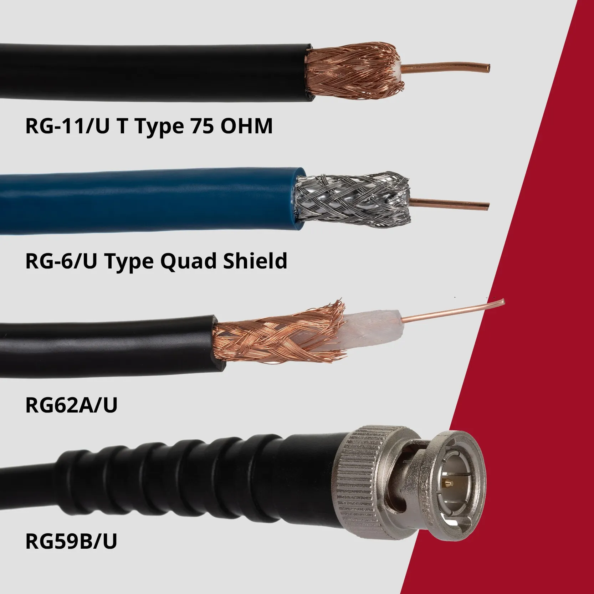

#### Coaxial Cable Structure

- Outer PVC jacket
  - Protects the cable physically.
  - Often black, white, etc.
- Metallic shield
  - Provides shielding against electromagnetic interference.
- Insulator
  - Separates the shield from the center conductor.
- Metallic center conductor
  - Carries the electrical signal.

```
┌─────────────────────────────┐
│ Outer PVC Jacket            │
│ ┌─────────────────────────┐ │
│ │ Metallic Shield         │ │
│ │ ┌─────────────────────┐ │ │
│ │ │ Insulator           │ │ │
│ │ │   ┌─────────────┐   │ │ │
│ │ │   │ Center      │   │ │ │
│ │ │   │ Conductor   │   │ │ │
│ │ │   └─────────────┘   │ │ │
│ │ └─────────────────────┘ │ │
│ └─────────────────────────┘ │
└─────────────────────────────┘
```

#### Coaxial Cable Connectors

##### BNC Connector (Bayonet Neill–Concelman)

- Commonly used with coaxial networks in the 1980s.
- Uses a push-and-twist locking mechanism

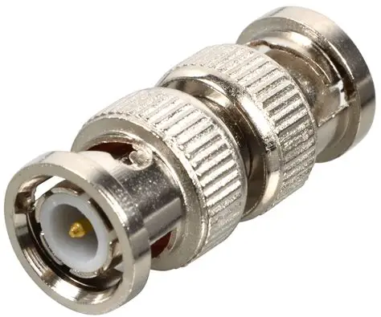

##### F Connector

- The F-type connector is commonly used for:
  - Cable modems  
  - Cable TV

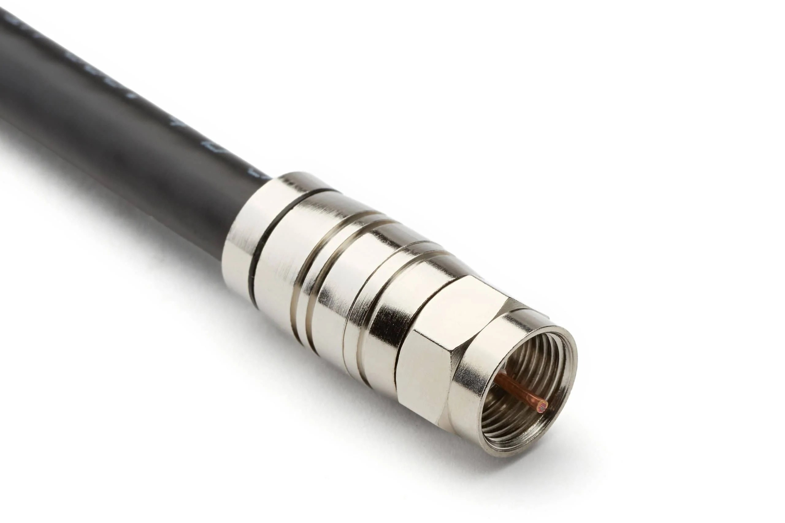

#### RG-59 vs RG-6

- There are different types/thicknesses of coaxial cable.

| Type      | Characteristics | Typical use              |
| --------- | --------------- | ------------------------ |
| **RG-59** | Thinner         | Older/video applications |
| **RG-6**  | Thicker         | Cable modem / cable TV   |


### Twisted Pair

#### What is the Twisted Pair?

- Twisted pair copper cabling is the most common type of network cabling.
- It normally uses an RJ-45 connector.
- Each cable contains four twisted pairs, for a total of 8 copper wires
- Each pair carries balanced signals
  - Wire 1 -> Positive signal
  - Wire 2 -> Negative signal

#### Why Are the Wires Twisted?

- The main purpose of twisting is to reduce interference

##### Crosstalk

- Crosstalk occurs when a signal from one pair interferes with another pair.
  - The twisting helps reduce this interference between pairs

```
Orange pair ──────┐
                  ├── Signal interference
Green pair  ──────┘
```

##### Electromagnetic Interference (EMI)

- Twisting makes the cable less susceptible to EMI
  - EMI is disruption to electronic equipment caused by electromagnetic fields from other electronic devices.
- Examples include environments containing:
  - Manufacturing equipment
  - Motors
  - Large electrical devices
  - Other sources of electromagnetic fields

#### UTP vs STP

- There are two major forms of twisted-pair cabling:

| Type    | Meaning                 | Shielding            | Typical environment   |
| ------- | ----------------------- | -------------------- | --------------------- |
| **UTP** | Unshielded Twisted Pair | No additional shield | Normal offices/homes  |
| **STP** | Shielded Twisted Pair   | Yes                  | High-EMI environments |

- UTP
  - cheaper
  - common in normal offices
- STP
  - better protection against EMI
  - more expensive
  - useful in manufacturing/industrial environments with significant EMI.

#### Factors Affecting Cable Speed

##### Twist rate

- Higher-category cables generally have more twists per inch.
- More twisting helps reduce crosstalk and interference

```
CAT 5e  → fewer twists
CAT 6   → more twists
CAT 7   → more twists
CAT 8   → more twists
```

##### Conductor Quality

- Better-quality copper and more consistent wire diameter can improve:
  - Signal transmission
  - Signal integrity
  - Data rates

##### Insulation and separation

- Better insulation and physical separation between pairs help reduce:
  - Interference
  - Signal degradation

##### Shielding

- Shielding helps block EMI, especially in electrically noisy environments.

##### Supported frequency

- Higher maximum frequency generally allows the cable to support higher network speeds.

#### Twisted-Pair Cable Categories

| Category   | Example Ethernet standard | Approx. maximum speed* | Typical max distance |
| ---------- | ------------------------- | ---------------------: | -------------------: |
| **Cat 3**  | 10Base-T                  |                10 Mbps |                100 m |
| **Cat 5**  | 100Base-TX                |               100 Mbps |                100 m |
| **Cat 5e** | 1000Base-T                |                 1 Gbps |                100 m |
| **Cat 6**  | 1000Base-T / 10GBASE-T    |              1–10 Gbps |         100 m / 55 m |
| **Cat 6a** | 10GBASE-T                 |                10 Gbps |                100 m |
| **Cat 7**  | 10 Gbps-class             |               10 Gbps+ |              ~100 m* |
| **Cat 8**  | 25/40GBASE-T              |             25–40 Gbps |                 30 m |

- The general progression is:
  - Higher bandwidth → higher speed → better signal performance
  - However, higher category doesn't automatically mean longer distance
    - Higher speed can require shorter cable distances.

```
Cat 3
  ↓
Cat 5
  ↓
Cat 5e
  ↓
Cat 6
  ↓
Cat 6a
  ↓
Cat 7
  ↓
Cat 8
```

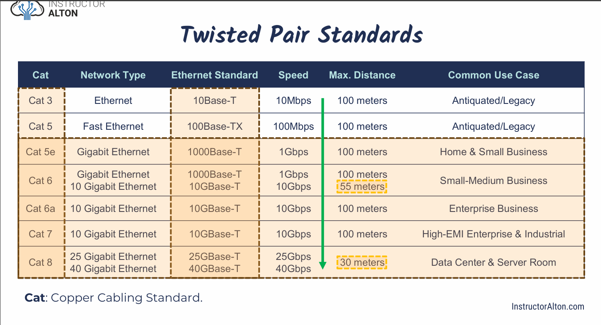

#### Cable Category vs Ethernet Standard

- Retailers usually advertise the Cat number.
- So when shopping for a cable, you're much more likely to search for:
  - Cat 6 Ethernet cable rather than 1000Base-T cable

#### Common Categories

- Cat 5e
  - Up to 1 Gbps
  - Inexpensive
  - Very common
- Cat 6
  - Up to 1 Gbps at 100 m
  - Can support 10 Gbps over shorter distances
  - Slightly more expensive
  - Very common
- Cat 6a
  - Designed for 10 Gbps up to 100 m
  - More expensive than Cat 6
- Cat 7 / Cat 8 More specialized:
  - Higher performance
  - Often shielded
  - More expensive
  - Cat 7: useful in environments with higher EMI requirements
  - Cat 8: very short, high-speed data-center/server-room links

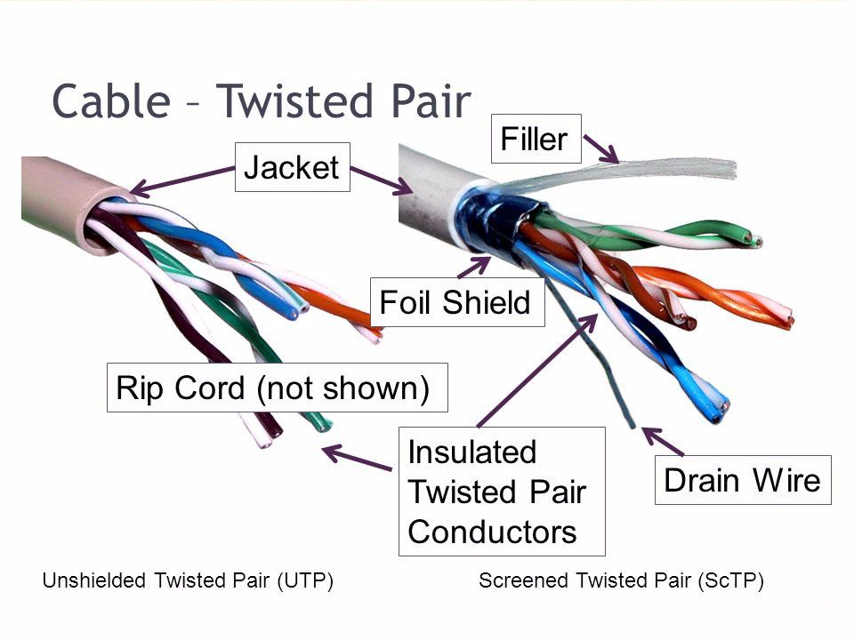

#### RJ-45 Connectors

##### Four Color-Coded Pairs

- The four twisted pairs are color-coded:
  - Orange / Orange-White
  - Green  / Green-White
  - Blue   / Blue-White
  - Brown  / Brown-White
- So 8 wires -> 4 twisted pairs -> RJ-45 connector

##### TIA/EIA 568A and 568B

- TIA/EIA 568A and 568B are industry wiring standards that define how the 8 wires are arranged on an RJ-45 connector. There are two standards: 568A and 568B.
- 568A → original standard
- 568B → newer standard and commonly used
- Both can work for network cabling.
- The important thing is to use one standard consistently throughout a network.

##### 568A Pinout

| Pin | Wire         |
| --: | ------------ |
|   1 | White/Green  |
|   2 | Green        |
|   3 | White/Orange |
|   4 | Blue         |
|   5 | White/Blue   |
|   6 | Orange       |
|   7 | White/Brown  |
|   8 | Brown        |


##### 568B Pinout

| Pin | Wire         |
| --: | ------------ |
|   1 | White/Orange |
|   2 | Orange       |
|   3 | White/Green  |
|   4 | Blue         |
|   5 | White/Blue   |
|   6 | Green        |
|   7 | White/Brown  |
|   8 | Brown        |

##### Straight-Through vs Crossover

- There are two traditional Ethernet cable types:
  - Straight-through  
  - Crossover
  - The difference is the pinout on each end

###### Straight-through

- Both ends use the same standard:

```
568B ───────────── 568B
```

```
568A ───────────── 568A
```

- Traditionally used to connect unlike devices:

```
PC ─────── Switch
Switch ─── Router
```

###### Crossover

- The two ends use different standards:

```
568A ───────────── 568B
```

- Traditionally used to connect like devices

```
PC ───── PC
Router ─ Router
```

##### Why Do We Need Crossover Cables?

- This comes from obsolete/antiquated  Ethernet technology. For 10Base-T and 100Base-T
  - One pair was used for transmitting (TX).
  - One pair was used for receiving (RX).
  - Only pins 1, 2, 3, and 6 were used.
  - The green and orange pairs had different TX/RX roles.

- Example: If both PCs use a straight-through cable

```
PC A                         PC B

TX Pin 1 ──────────────────────► Pin 1 TX
TX Pin 2 ──────────────────────► Pin 2 TX

RX Pin 3 ◄────────────────────── Pin 3 RX
RX Pin 6 ◄────────────────────── Pin 6 RX
```

##### Modern Gigabit Ethernet (GBase-T)

- Starting with Gigabit Ethernet / Cat 5e and newer:
  - Uses all four pairs
  - Uses the blue and brown pairs in addition to green and orange.
  - Each pair can support bidirectional transmission.
  - Data can travel in both directions on each pair.
- Therefore: Crossover cables became largely unnecessary with modern Gigabit Ethernet equipment.

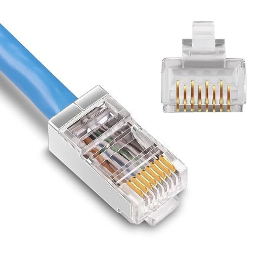

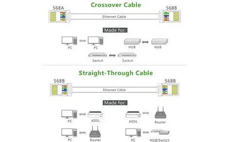

#### Other Copper Connectors

- RJ-11
  - Smaller than RJ-45
  - Uses two twisted pairs / four wires in the lecture's description
  - Primarily associated with telephone/landline connections
  - Not normally used for Ethernet networking.

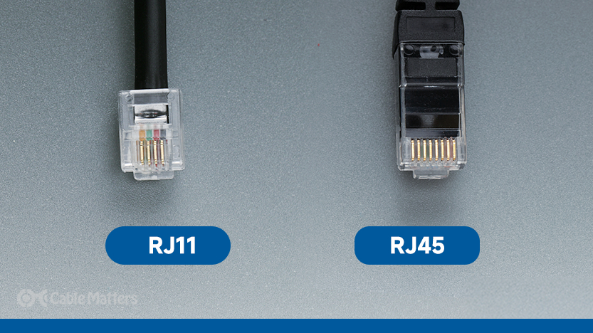

- DB-9
  - Used for serial connections.
  - A typical networking use is connecting directly to a managed:
    - Switch
    - Router
    - for access to its CLI/console management interface.

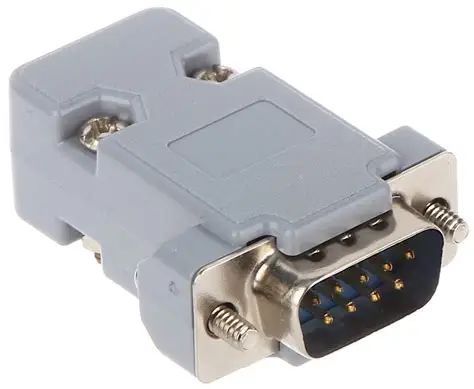

- DB-25
  - An older connector historically used for things such as serial printer connections. 
  - It is now largely obsolete

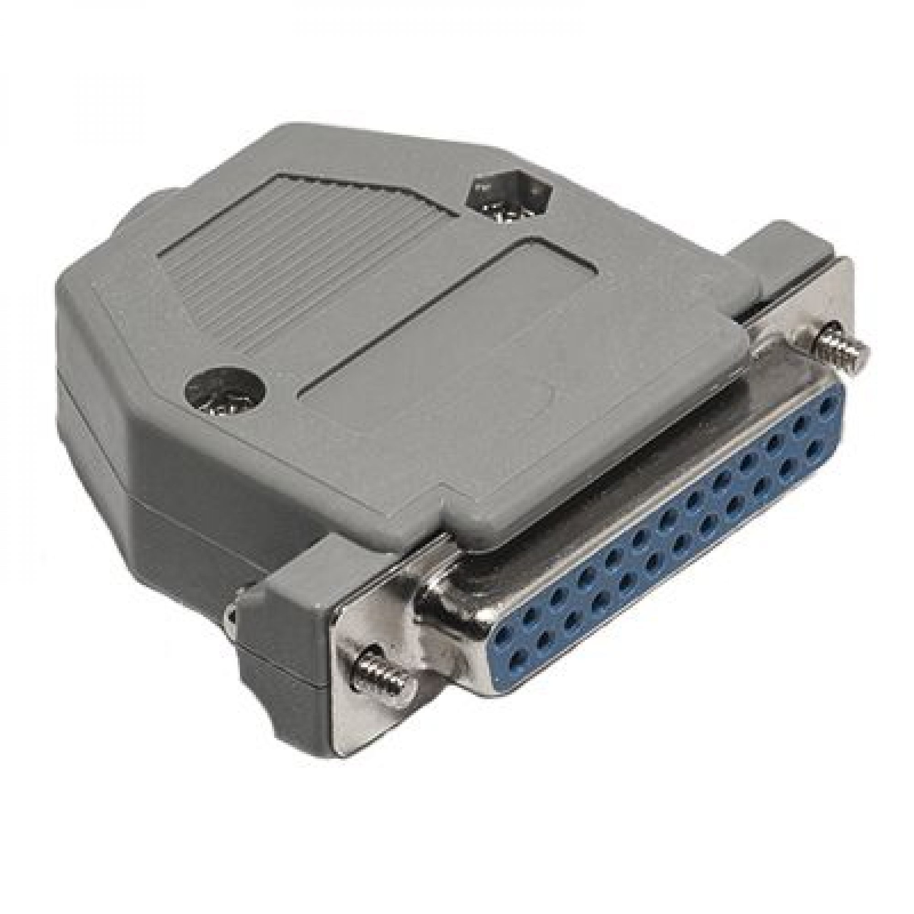

### Fiber Optic

#### What Is Fiber Optic Cabling?

- Fiber optic cabling is different from traditional twisted-pair copper cabling because it does not transmit electrical signals.
- Instead, fiber optic cable uses photons (light) to transmit data.
- The center of the cable contains a glass or plastic core through which light pulses travel
  - The outer jacket, buffer, and cladding protect the core.
- Fiber is commonly used in:
  - Enterprise networks
  - WANs
  - Long-distance network connections
  - ISP networks

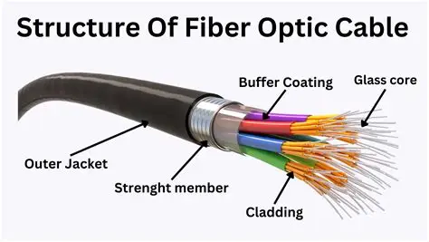

#### Advantages of Fiber Optic

- Fiber optic is more expensive than twisted-pair copper, including both the cable and related equipment. However, it provides several major advantages

##### Higher bandwidth

- Fiber can support significantly higher speeds

##### Much longer distance

- Copper twisted-pair: 100 meters
- Fiber can reach: 75 miles or more in the example given.

##### Fiber Is Not Affected by EMI

- Another major advantage is that fiber optic cabling:
  - Does not suffer from electromagnetic interference (EMI)
  - Does not emanate electrical signals

#### Types of Fiber

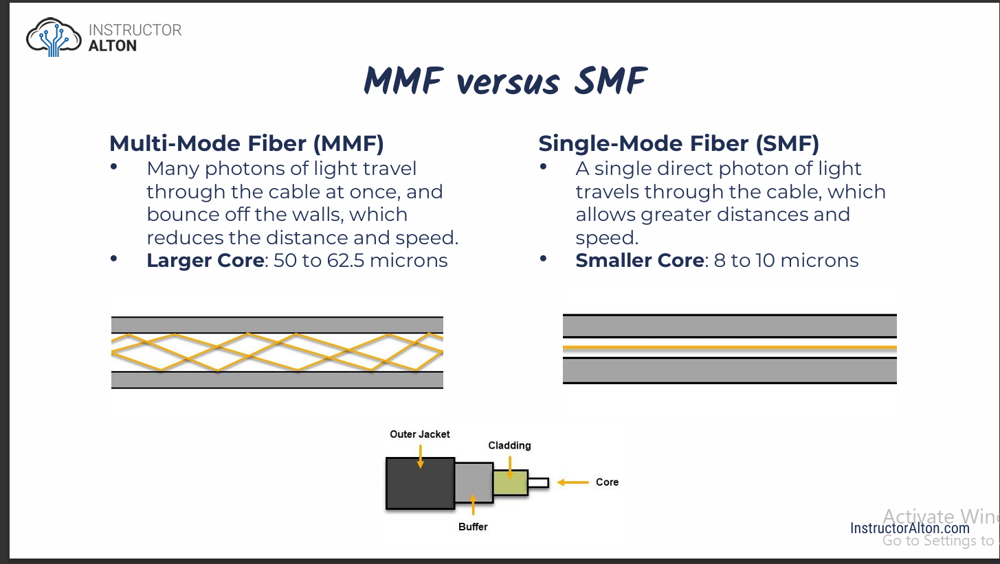

##### Multimode Fiber

- Multimode fiber has a larger core: 50–62.5 microns
- It allows multiple light beams to travel through the fiber simultaneously.
- The light can bounce off the walls of the core, which limits its distance and speed compared with single-mode fiber.
- Typical use:
  - LANs
  - Campus networks
  - Building-to-building connections
  - Shorter distances

##### Single-Mode Fiber

- Single-mode fiber has a much smaller core: 8–10 microns
- It carries essentially one light beam at a time.
- Because the light does not bounce off the walls in the same way as multimode transmission, it can support:
  - Longer distances
  - Higher speeds
- Typical use:
  - ISP networks
  - Metropolitan Area Networks (MANs)
  - Long-distance connections

##### Multimode vs Single-Mode

| Feature     | Multimode              | Single-mode               |
| ----------- | ---------------------- | ------------------------- |
| Core size   | 50–62.5 µm             | 8–10 µm                   |
| Light       | Multiple beams         | One beam                  |
| Distance    | Shorter                | Much longer               |
| Speed       | Lower than single-mode | Higher                    |
| Typical use | LAN / campus           | ISP / MAN / long-distance |


#### Fiber Optic Connectors

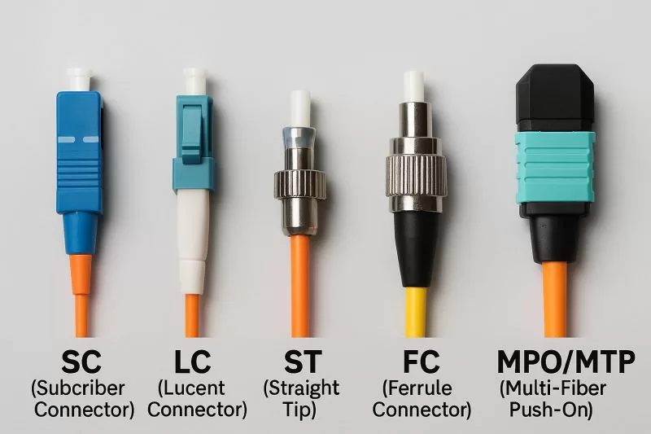

##### LC — Lucent Connector

- Small connector
- Uses a locking flange similar in appearance to RJ-45
- Designed for one fiber
- Used with both multimode and Single-Mode Fiber 
- Common in Gigabit and 10-Gigabit Ethernet applications

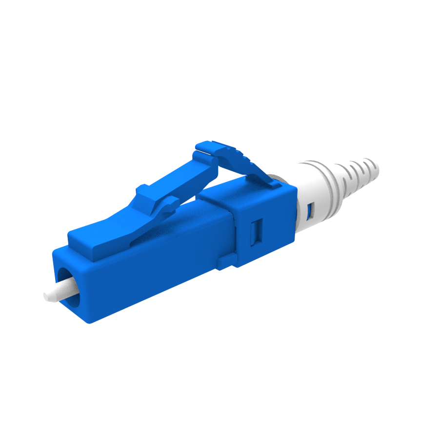

##### SC — Subscriber Connector

- Square-shaped connector
- Uses a push-pull mechanism
- Used with Multimode Fiber and Single-Mode Fiber Gigabit Ethernet applications.

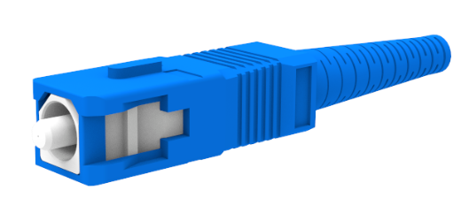

##### ST — Straight Tip

- Round connector
- Uses a bayonet-style twist-and-lock mechanism
- Similar to the locking mechanism used by older BNC-style connectors.
- Historically used with multimode fiber.
- No longer commonly used

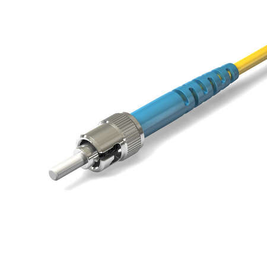

##### MTRJ — Mechanical Transfer Registered Jack

- Similar appearance to LC
- Designed for two fibers
- Commonly associated with multimode fiber in the lecture

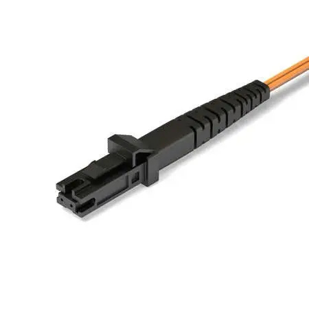

## Network Interface Card (NIC)

### What is a NIC?

- A Network Interface Card (NIC) is a hardware component that allows a device to connect and communicate with a network.
- Other terms for NIC include:
  - Network Interface Card
  - NIC
  - Network Adapter
- If a device needs to communicate on a network, it needs at least one network interface.

### NIC and MAC Address

- Each NIC has a unique MAC address associated with it.

```
NIC
 └── MAC Address
       ↓
   Unique identifier
```

- The MAC address is associated with the network interface hardware.
- Although the operating system can spoof the MAC address, that does not physically change the hardware's original address

### A Device Can Have Multiple NICs

- A computer does not have to have only one NIC.
- Example
  - Each network interface can have its own: MAC address, IP address

```
# A modern desktop might have

Desktop
 ├── Ethernet NIC
 │     └── RJ-45
 │
 └── Wi-Fi NIC
       └── Radio
```

```
# Servers commonly have multiple network interfaces

Server
 ├── NIC 1 → Network A
 └── NIC 2 → Network B
```

## Hub

### What is a Hub?

- A hub is a legacy networking device that was commonly used in older networks.
- Today, hubs have been almost completely replaced by switches.
- A hub and a switch may look physically similar, but they operate very differently internally.
  - Hub = Dumb device
  - Switch = Smart device

### Hub and Star Topology

- A hub can act as the central connecting device in a star topology.

```
# All devices connect to the hub.

          PC1
           │
PC2 ───── HUB ───── PC3
           │
          PC4

```

### Hub = Multi-Port Repeater

- A hub is essentially a multi-port repeater.
  - When data enters one port, the hub repeats it out through all other connected ports.
- For example
  - Even if PC1 only wants to communicate with PC4, the hub sends the signal to PC2, PC3, and PC4.
  - PC2 and PC3 will receive the signal and determine that the data isn't intended for them, so they discard it.

```
PC1 ──> HUB ──> PC2
             ├─> PC3
             └─> PC4
```

### Why Are Hubs Bad?

#### Network Collisions

- Because the hub sends traffic to every port, all connected devices share the same communication medium.
  - This creates a collision.
  - The larger the network, the greater the potential for collisions.

#### Security Problem

- Hubs can also create security concerns.
  - Because traffic is repeated out to every port
  - Other devices may receive traffic that wasn't intended for them.
  - A switch, on the other hand, can make forwarding decisions based on MAC addresses, so traffic can normally be sent only toward the appropriate destination port.

## Wireless Range Extender - Wi-Fi Repeater

### What is a Wireless Range Extender?

- A Wireless Range Extender is a device that extends the coverage/range of an existing Wi-Fi network.
- It works similarly to a repeater
  - The extender receives the wireless signal from the WAP and rebroadcasts it to areas where the original signal is weak.

### How Does It Work

- So the extender does not create a completely new network connection. 
- It mainly repeats/rebroadcasts the existing wireless signal.

```
Wireless Access Point
        │
        │ Wi-Fi signal
        ▼
[Range Extender]
        │
        │ Re-broadcast
        ▼
  Extended Wi-Fi Area
```

### When Would You Use One?

- A range extender is useful when
  - Your house is large.
  - Your office has areas with weak Wi-Fi.
  - Some rooms are outside the WAP's effective coverage.
  - There is radio-frequency interference.
  - You have multiple floors.

## Modem

### What Is a Modem?

- **Modem = Modulator + Demodulator**. The name comes from:
  - Mo → Modulator
  - Dem → Demodulator
- Its basic job is to convert signals between the communication medium and the form used by the computer/network equipment.

### Cable Internet Example

- A typical home cable Internet setup

```
          ISP / Internet
                │
          Coaxial Cable
        (lecture: analog)
                │
                ▼
            [Modem]
        Analog ↔ Digital
                │
            RJ-45 Ethernet
                │
                ▼
        [SOHO Device]
                │
            Router
                │
            Firewall
                │
      ┌─────────┴───────┐
      │                 │
      WAP              DHCP
      │                 │
      └────────┬────────┘
               │
            Home LAN
```

## Media Converter

### What Is a Media Converter?

- A media converter is a device that converts a network signal from one physical media type to another.
- The most common example is: **Copper Ethernet ↔ Fiber Optic**

```
[Switch]
   │
   │ RJ-45 / Copper
   ▼
[Media Converter]
   │
   │ Fiber Optic
   ▼
[Server]
```

### Why Do We Need One?

- Different network devices may use different physical media.
- For example:
  - Switch → Copper Ethernet (RJ-45)
  - Server → Fiber optic
  - They cannot directly connect using their different cable types.
  - The media converter sits between them and converts the physical signal

# Data link - OSI layer 2 - Network Access - TCP/IP Layer 1

## MAC Addresses - Media Access Control (MAC)

### What is a MAC Address?

- MAC stands for Media Access Control.
- A MAC address is the physical/hardware address associated with a device's **network adapter**.
- A network adapter is also called:
  - Network Interface Card (NIC)
  - Network Adapter
  - These terms are generally interchangeable


### MAC Address vs. MAC Address Spoofing

- Traditionally, a MAC address is assigned to the network interface hardware.
- It is associated with the hardware rather than being simply an IP address configured by the user.
- However, an operating system can perform MAC address spoofing.
  - The hardware's original MAC address isn't physically changed. Instead, the operating system is instructed to use a different MAC address.
  - MAC spoofing is also relevant in cybersecurity and network testing.

### MAC Address Format

- A MAC address is: 48 bits - 6 bytes
  - Usually represented in hexadecimal
  - Example: 00:1A:2B:3C:4D:5E

```
00 : 1A : 2B : 3C : 4D : 5E
 └───────┘   └───────────────┘
   3 bytes         3 bytes
  (24 bits)       (24 bits)
    |                 |
    ▼                 ▼
   OUI       Individual identifier
```

#### OUI — Organizationally Unique Identifier

- OUI stands for Organizationally Unique Identifier.
- The OUI identifies the organization/manufacturer associated with the network interface.
- OUIs are assigned through the IEEE
  - Institute of Electrical and Electronics Engineers

#### Individual identifier

- The remaining 24 bits can be used to identify individual network interfaces under that OUI.
- 2²⁴ ~16.7 Million Unique Addresses

## Switch

### What is a Switch?

- A switch is a network device used to connect multiple devices in a LAN (Local Area Network).
- Like a hub, a switch can act as the central connecting device in a star topology.
  - Although a hub and switch may look similar physically, they work very differently internally.

```
          PC1
           │
PC2 ──── Switch ──── PC3
           │
          PC4
```

### MAC Address Table / CAM Table

- A switch learns the MAC addresses of connected devices and stores them in a table.
- This table can be called:
  - MAC address table
  - CAM table (CAM = Content Addressable Memory)

### How a Switch Forwards Data

```
PC1 ──> Switch ──> MAC Address Table -> MAC Destination -> Port -> PC4
```

- Suppose PC1 wants to send data to PC4.
  - The switch checks its MAC/CAM table: `PC4's MAC → Port 4`
  - Therefore, it forwards the frame only through Port 4.
  - Another devices don't receive the frame

### Collision Domains

- One of the biggest advantages of a switch is that it breaks up collision domains.
- **Hub**: A hub creates essentially one large collision domain
- **Switch**: With a switch, each switch port represents a separate collision domain in the traditional Ethernet model

### Security Advantage

- Switches are also more secure than hubs.
- Remember
  - A switch does not automatically make a network completely secure. 
  - There are techniques such as MAC flooding, port mirroring, ARP spoofing, etc., that can affect Layer 2 security.

| **Hub**                                                                                                                    | **Switch**                                                                 |
| -------------------------------------------------------------------------------------------------------------------------- | -------------------------------------------------------------------------- |
| Because the hub **repeats the signal to every port**, another device connected to the hub may potentially capture traffic. | The switch normally **forwards the frame only toward the appropriate por** |


### Broadcast Domain

- A switch does NOT normally break up a broadcast domain.
- Example

```
# For example, if PC3 sends a broadcast
# The broadcast can be forwarded to the other ports.

              ┌──→ PC1
              ├──→ PC2
PC3 → SWITCH ─┼──→ PC4
              └──→ PC5
```

- Therefore: **A basic Layer 2 switch = multiple collision domains but one broadcast domain.**

### Why the switch can still have one large broadcast domain?

- When a new computer joins a network, it may not have an IP address yet.
  - It can send **a DHCP broadcast** asking: "Is there a DHCP server that can give me an IP address?"
  - The switch can forward this broadcast within the LAN.

```
PC
 │
 │ DHCP Broadcast
 ↓
Switch
 │
 ├──→ Other devices
 │
 └──→ DHCP Server
```

- This is why the switch can still have **one large broadcast domain**, even though it has **multiple collision domains**

### Switch vs. Hub

- The most important difference:
  - Hub -> repeats traffic everywhere
  - Switch -> intelligently forwards traffic to the destination

|                    | **Hub**         | **Switch**           |
| ------------------ | --------------- | -------------------- |
| OSI Layer          | **Layer 1**     | **Layer 2**          |
| Type               | Dumb device     | Intelligent device   |
| Main function      | Repeats signals | Forwards frames      |
| Uses MAC addresses | ❌               | ✅                    |
| Traffic            | To all ports    | To destination port  |
| Collision domains  | **1 large**     | **Multiple smaller** |
| Modern LANs        | Legacy          | **Standard**         |

## Wireless Access Point (WAP)

### What is a Wireless Access Point?

- A Wireless Access Point (WAP) is a dedicated network device that bridges a wired network to a wireless network.

```
Wired Network
     │
     │ Ethernet cable
     ▼
   [ WAP ]
   /  |  \
  /   |   \
Wi-Fi Wi-Fi Wi-Fi
 PC  Phone  Tablet
```

### WAP is NOT a Router

| Device          | Main Function                                               |
| --------------- | ----------------------------------------------------------- |
| **WAP**         | Bridges wired network ↔ wireless network                    |
| **Router**      | Connects different IP networks and performs Layer 3 routing |
| **SOHO device** | Usually combines router + switch + WAP + other functions    |


### What Devices Connect to a WAP?

- A WAP allows many wireless devices to connect to the network:
  - Smartphones
  - Laptops
  - Tablets
  - IoT devices
  - Smart speakers
  - Smart lights
  - Smart plugs
  - Smart refrigerators
  - Smart garage doors
  - Other wireless devices

## Network Protocol

### ARP - Address Resolution Protocol

#### What is ARP?

- ARP (Address Resolution Protocol) is used to resolve an IP address to its corresponding MAC address. 
  - **IP address → MAC address**
- ARP is needed when a device knows the destination's IP address but does not know its MAC address.

#### Where does ARP work?

- ARP works within the local area network (LAN).
  - ARP uses broadcast messages to find the device with a specific IP address.
  - Broadcast traffic is not forwarded by routers.
  - Therefore, ARP cannot directly resolve the MAC address of a device on another network.
  - For more detail broadcast: [Broadcast](#broadcast)

```
Same LAN:
PC1 ─── Switch ─── PC2
       ARP works

Different LAN:
PC1 ─── Router ─── PC2
       ARP does NOT cross the router
```

#### ARP Request vs ARP Reply

| Message         | Destination     | Purpose                               |
| --------------- | --------------- | ------------------------------------- |
| **ARP Request** | Broadcast       | Ask which device owns an IP address   |
| **ARP Reply**   | Usually Unicast | Return the MAC address of that device |


#### How ARP works

- Suppose

```
PC1:
IP: 192.168.1.100
MAC: Unknown

PC2:
IP: 192.168.1.115
MAC: AA:BB:CC:DD:EE:FF
```

- PC1 wants to communicate with PC2 but only knows `192.168.1.115`
  - PC1 sends an **ARP Request** as a broadcast: **Who has 192.168.1.115? Tell me your MAC address**

- Every device on the LAN receives the broadcast
  - Only PC2 recognizes that the requested IP belongs to it, so PC2 sends an **ARP Reply** **192.168.1.115 is at AA:BB:CC:DD:EE:FF.**

- PC1 can then associate **192.168.1.115 → AA:BB:CC:DD:EE:FF**
  - And use the MAC address to deliver the Ethernet frame

- After learning the MAC address, the device stores the mapping in its ARP cache/table
  - Example

```
Interface: 192.168.2.48 --- 0x5
  Internet Address      Physical Address      Type
  192.168.2.1           14-49-bc-6e-82-90     dynamic
  192.168.2.10          58-cd-c9-51-e3-e3     dynamic
  192.168.2.12          a8-42-a1-c3-cf-6f     dynamic
  192.168.2.13          20-0b-74-13-a4-fe     dynamic
  192.168.2.14          e4-24-6c-a7-1a-2b     dynamic
  192.168.2.17          6e-76-54-32-9b-26     dynamic
.....................................................

Interface: 192.168.56.1 --- 0xb
  Internet Address      Physical Address      Type
  192.168.56.255        ff-ff-ff-ff-ff-ff     static
  224.0.0.2             01-00-5e-00-00-02     static
  224.0.0.22            01-00-5e-00-00-16     static
....................................................
```

#### Viewing the ARP table

- The basic command on macOS, Linux, Windows is `arp -a`

# Network - OSI layer 3 - Internet - TCP/IP Layer 2

## IP Address

### What is an IP Address?

- IP stands for Internet Protocol.
- An IP address is a logical address used to identify a device on a network.
- Unlike a MAC address, an IP address is configured by the operating system/network configuration.
  - It can be assigned in two main ways:
    - Automatically -> using DHCP
    - Manually -> Manually configured. The administrator enters the IP address.
- Example
  - Pv4 - 192.168.1.10
  - IPv6 - 2001:db8::1

### IP Address vs MAC Address

| **Category**                 | **IP Address**                                                                                         | **MAC Address**                                                                                              |
| ---------------------------- | ------------------------------------------------------------------------------------------------------ | ------------------------------------------------------------------------------------------------------------ |
| **Definition**               | A **logical address**                                                                                  | A **physical/hardware address** associated with a network interface card (NIC)                               |
| **OSI Layer**                | **Layer 3 — Network Layer**                                                                            | **Layer 2 — Data Link Layer**                                                                                |
| **Main Purpose**             | Used for **network-to-network communication**, especially when traffic needs to travel through routers | Used primarily for **communication within a local network (LAN)**                                            |
| **Communication**            | **Network → Network**                                                                                  | **Device/interface → Device/interface within a local network**                                               |
| **Main Network Device**      | **Router**                                                                                             | **Switch**                                                                                                   |
| **Assignment**               | **Static** or **Dynamic**                                                                              | Associated with the **NIC hardware**                                                                         |
| **Static Assignment**        | Manually configured by a network administrator                                                         | Normally associated with the network interface hardware                                                      |
| **Dynamic Assignment**       | Automatically assigned by a **DHCP server**                                                            | Not normally assigned by DHCP                                                                                |
| **Can be spoofed?**          | Yes                                                                                                    | Yes — the OS can spoof a MAC address, but this does not physically change the address stored by the hardware |
| **Example**                  | `192.168.1.10`                                                                                         | `00:1A:2B:3C:4D:5E`                                                                                          |
| **Example of communication** | Your home network → Router → Internet → Gmail network → Gmail server                                   | PC → Switch → PC / Printer                                                                                   |
| **Key concept**              | **Routing**                                                                                            | **Switching**                                                                                                |

### Internet Protocol version 4 - IPv4

### Internet Protocol version 6 - IPv6


## Router

### What Does a Router Do?

- A router connects different networks together.
- This is the key difference:
  - Switch → connects devices within the same network
  - Router → connects different networks

- Example: If PC1 wants to communicate with PC3, they are on different networks, so the traffic must pass through the router.

```
Network A                              Network B
192.168.1.0/24                         192.168.2.0/24

 PC1 ──┐                              ┌── PC3
       │                              │
    [Switch]                        [Switch]
       │                              │
 PC2 ──┘                              └── PC4
       │                              │
       ↓                              ↓
   [Router A] ──────────────── [Router B]
       │        Network Link        │
       └────────────────────────────┘
```

### Router Uses IP Addresses

- A router operates primarily at: **OSI Layer 3 — Network Layer**
- It uses **IP addresses** to determine where packets should go.

| Device | OSI Layer | Main Address | Main Function                  |
| ------ | --------: | ------------ | ------------------------------ |
| Hub    |   Layer 1 | —            | Repeat signals                 |
| Switch |   Layer 2 | **MAC**      | Forward frames within LAN      |
| Router |   Layer 3 | **IP**       | Route packets between networks |

### Router vs Switch

- **Switch**: "Which port is this MAC address connected to?"

```
# Same Network

PC1 ─── Switch ─── PC2
       MAC address
```

- **Router**: "Which network should I send this IP packet toward?"

```
# Different Networks

PC1 ─── Switch ─── Router ─── Switch ─── PC2
                  IP address
```

### Routers Determine the Best Path

- The routers determine an appropriate/best route toward the destination based on their routing information

### A router separates broadcast domains

- A router therefore creates a boundary between different Layer 3 networks/broadcast domains.

```
 Broadcast Domain A
 PC1 ── Switch ──┐
                 │
              [Router]
                 │
                 └── Switch ── PC3
                     Broadcast Domain B
```

### Example

```
# When PC1 wants to communicate with PC3:

PC1
Network: 192.168.1.0/24

        ↓

[Switch]

        ↓

[Router]

        ↓

[Switch]

        ↓

PC3
Network: 192.168.2.0/24
```

- Step 1 — PC1 sends the frame
  - PC1 sends traffic toward the router through the local switch.
- Step 2 — Switch forwards using MAC
  - The switch examines the destination MAC address and uses its CAM/MAC table to determine the correct port.
- Step 3 — Router receives the packet
  - The router examines the destination IP address
- Step 4 — Router chooses the route
  - The router checks its routing information and determines where to forward the packet.
- Step 5 — Destination network
  - Eventually the packet reaches the destination network.
  - The destination switch then uses MAC addresses to deliver the frame to PC3

## Network Protocol

### Internet Protocol - IP

#### What is IP?

- IP (Internet Protocol) is a protocol of the TCP/IP Internet layer and corresponds primarily to Layer 3 (Network Layer) of the OSI model.
- IP provides end-to-end connectivity between different Layer 2 networks.
- Its two major responsibilities are:
  - Logical addressing → IP addresses
  - Routing → moving packets between different networks

#### IP Addresses

IP provides logical addressing. There are two major versions:

| Version | Name                        | Example        |
| ------- | --------------------------- | -------------- |
| IPv4    | Internet Protocol version 4 | `192.168.1.10` |
| IPv6    | Internet Protocol version 6 | `2001:db8::1`  |

#### Characteristics of IP

| Characteristic               | Description                                                     |
| ---------------------------- | --------------------------------------------------------------- |
| **Connectionless**           | IP does not establish a connection before sending packets.      |
| **Unreliable**               | IP does not guarantee packet delivery.                          |
| **Best effort**              | IP attempts to deliver packets but provides no guarantee.       |
| **Independent packets**      | Each packet is handled independently.                           |
| **No sequencing**            | IP does not ensure packets arrive in the correct order.         |
| **No error recovery**        | IP does not retransmit lost or corrupted packets.               |
| **No delivery confirmation** | IP does not check whether the destination received the packet.  |
| **Supports routing**         | Routers use IP information to forward packets between networks. |

#### Packets Can Take Different Paths

- Because IP works with routing, different packets belonging to the same communication may take different paths.

### ICMP - Internet Control Message Protocol

#### What is ICMP?

- ICMP (Internet Control Message Protocol) is a companion protocol to IP and operates at the OSI Layer 3 – Network Layer.
- Its main purpose is:
  - Reporting network errors
  - Reporting delivery problems
  - Performing network diagnostics
  - Helping troubleshoot connectivity
- Important: ICMP reports problems but does not fix them.

#### Key Characteristics

- ICMP does not establish a session before sending messages

| Characteristic       | Description                            |
| -------------------- | -------------------------------------- |
| **Layer**            | OSI Layer 3 – Network                  |
| **Works with**       | IP                                     |
| **Connection**       | Connectionless                         |
| **Purpose**          | Error reporting and diagnostics        |
| **Application data** | Does not carry normal application data |
| **Common tools**     | `ping`, `traceroute` / `tracert`       |

#### ICMP Demo

##### Traceroute / Tracert

- Traceroute is used to discover the network path from a source to a destination

| OS      | Command                    |
| ------- | -------------------------- |
| Linux   | `traceroute <destination>` |
| macOS   | `traceroute <destination>` |
| Windows | `tracert <destination>`    |

##### Ping

- `ping` is used to test whether a destination responds to ICMP Echo messages

```bash
ping 192.168.0.20
```

# Transport - OSI layer 4 - Transport - TCP/IP Layer 3

## Network Protocol

### Understanding Protocols, Ports, and Sockets

#### Protocols

- A protocol is a set of rules that defines how computers communicate and exchange data.
- Examples from the lecture:  DN ,DHC ,HTTP / IIS
- For more detail: [Introduction to Computer Networking Protocols](#introduction-to-computer-networking-protocols)

#### Logical Ports

- A port in networking is a logical port, not a physical port such as USB or RJ-45.
- Ports allow a computer to distinguish between different network applications running on the same machine
- A protocol is associated with a specific port number.

| Protocol |    Port | Purpose                  |
| -------- | ------: | ------------------------ |
| FTP      |      21 | File Transfer            |
| HTTP     |      80 | Web                      |
| DNS      |      53 | Domain Name System       |
| DHCP     | 67 / 68 | Dynamic IP configuration |
| HTTPS    |     443 | Secure Web               |

- Example
  - A server has `IP: 192.168.1.100`
  - It can simultaneously run
    - FTP  → 21
    - HTTP → 80
    - DNS  → 53
  - So a client can specify
    - 192.168.1.100:21  → FTP
    - 192.168.1.100:80  → HTTP
    - 192.168.1.100:53  → DNS

##### Why Do We Need Ports?

- A server can run multiple network services simultaneously
- Without port numbers, the operating system would not know which application should receive incoming network traffic

```
                Server
            192.168.1.100
                   │
       ┌───────────┼───────────┐
       ↓           ↓           ↓
     FTP         HTTP         DNS
     :21         :80          :53
```

##### Three Types of Ports

| Port Type            |       Range | Description                                    |
| -------------------- | ----------: | ---------------------------------------------- |
| **Well-known ports** |      0–1023 | Used by well-known protocols                   |
| **Registered ports** |  1024–49151 | Registered for specific applications/protocols |
| **Dynamic ports**    | 49152–65535 | Used dynamically, typically by clients         |


#### Socket

- A socket is the combination of **IP Address + Port Number**
- This allows the operating system to identify a specific network endpoint
- For example: `192.168.1.1:80` is a socket

#### Common Network Services and Port Numbers

| Service, Protocol, or Application | Port Number(s) | TCP or UDP |
|---|---:|---|
| FTP (File Transfer Protocol) | 20, 21 | TCP |
| SFTP (Secure File Transfer Protocol) | 22 | TCP |
| SSH (Secure Shell Protocol) | 22 | TCP |
| Telnet | 23 | TCP |
| SMTP (Simple Mail Transfer Protocol) | 25 | TCP |
| DNS (Domain Name System) | 53 | UDP |
| DHCP (Dynamic Host Configuration Protocol) | 67, 68 | UDP |
| TFTP (Trivial File Transfer Protocol) | 69 | UDP |
| HTTP (Hypertext Transfer Protocol) | 80 | TCP |
| POP3 (Post Office Protocol version 3) | 110 | TCP |
| NTP (Network Time Protocol) | 123 | UDP |
| IMAP4 (Internet Message Access Protocol version 4) | 143 | TCP |
| SNMP (Simple Network Management Protocol) | 161 | UDP |
| LDAP (Lightweight Directory Access Protocol) | 389 | TCP |
| HTTPS (Hypertext Transfer Protocol Secure) | 443 | TCP |
| SMB (Server Message Block) | 445 | TCP |
| LDAPS (Lightweight Directory Access Protocol Secure) | 636 | TCP |
| RDP (Remote Desktop Protocol) | 3389 | TCP |
| ITU Telecommunication Standardization Sector A/V Recommendation | 1720 | TCP |
| SIP (Session Initiation Protocol) | 5060, 5061 | TCP |

#### `netstat` command

- `netstat -aon` is a Windows command used to display network connections, listening ports, and the Process ID (PID) associated with each connection or port

| Option | Meaning                                                                                   |
| ------ | ----------------------------------------------------------------------------------------- |
| `-a`   | Displays **all** active connections and listening ports                                   |
| `-o`   | Displays **the Process ID (PID)** associated with each connection                         |
| `-n`   | Displays IP addresses and port numbers in **numerical format** instead of resolving names |

```
Active Connections

  Proto  Local Address          Foreign Address        State           PID
  TCP    0.0.0.0:135            0.0.0.0:0              LISTENING       2044
  TCP    0.0.0.0:445            0.0.0.0:0              LISTENING       4
  TCP    0.0.0.0:5040           0.0.0.0:0              LISTENING       7044
  TCP    0.0.0.0:5357           0.0.0.0:0              LISTENING       4
............................................................................
```

- This means:
  - TCP → The connection uses TCP.
  - 0.0.0.0:135 → The computer is listening on port 135 on all IPv4 network interfaces.
  - LISTENING → The application is waiting for incoming connections.
  - 2044 → The PID of the process using port 135.

##### What Does 0.0.0.0 Mean?

- `0.0.0.0:8080` means that the application is listening on all IPv4 network interfaces.
- For example, if a server has:
  - 192.168.1.10
  - 10.0.0.10
  - 127.0.0.1
- The service may accept connections through:
  - 192.168.1.10:8080
  - 10.0.0.10:8080
  - 127.0.0.1:8080
- In contrast, if an application is bound only to `127.0.0.1:8080`
  - it can normally be accessed only from the local machine.

##### LISTENING vs. ESTABLISHED

- LISTENING
  - The server has port 443 open and is waiting for incoming TCP connections.

```
TCP    0.0.0.0:443    0.0.0.0:0    LISTENING
```


- ESTABLISHED
  - The TCP connection between the two endpoints has been successfully established.

```
TCP    192.168.2.48:55560    113.176.13.49:80    ESTABLISHED
```

##### Common Administration Workflow

- Suppose you want to find out which process is using port 443.

```
netstat -aon | findstr :443

tasklist /FI "PID eq 1234"
```

##### For more detailed information

```
netstat -abno
```

| Option | Meaning |
|---|---|
| `-a` | Display all connections and listening ports |
| `-b` | Display the executable involved in creating the connection |
| `-n` | Display addresses and ports numerically |
| `-o` | Display the Process ID (PID) |

### Transmission Control Protocol - TCP

- Before transmitting application data, TCP establishes a connection using the three-way handshake:

```
Client                 Server
  │                       │
  │────── SYN ───────────→│
  │                       │
  │←──── SYN + ACK ───────│
  │                       │
  │────── ACK ───────────→│
  │                       │
  │   Connection ready    │
```

### User Datagram Protocol - UDP

- UDP doesn't establish a TCP-style connection before sending data.
  - This reduces overhead, but UDP itself does not provide TCP's reliability mechanisms.

```
Client ───────────────→ Server
        UDP data
```

### TCP vs UDP

| TCP                           | UDP                                    |
| ----------------------------- | -------------------------------------- |
| Transmission Control Protocol | User Datagram Protocol                 |
| Connection-oriented           | Connectionless                         |
| Uses connection establishment | No connection establishment            |
| Reliable delivery mechanisms  | No built-in reliable delivery          |
| Sequencing                    | No TCP-style sequencing/retransmission |
| More overhead                 | Lower overhead                         |
| Generally slower              | Generally faster/lower latency         |


# Application - OSI layer 7 - Application - TCP/IP Layer 4

## DHCP

### What Is DHCP?

- DHCP = Dynamic Host Configuration Protocol
- A DHCP server automatically assigns IP addresses to devices on a network.

### Static IP vs DHCP

- For a network with hundreds of devices, manually managing every IP becomes inconvenient and increases the chance of configuration mistakes or conflicts.

| Method     | How IP is assigned                   | Suitable for                             |
| ---------- | ------------------------------------ | ---------------------------------------- |
| **Static IP** | Administrator manually configures IP | Small networks, servers, special devices |
| **DHCP**   | Server automatically assigns IP      | Medium/large networks, clients           |


### Basic DHCP Architecture

- The new PC doesn't initially have an IP address, so it communicates on the network to find a DHCP server.
- The DHCP server can then provide an IP configuration.

```
# DORA Process
                 Network
                    │
          ┌─────────┴─────────┐
          │                   │
       [DHCP Server]        [New PC]
          │                   │
          │◄──── Request ─────┤
          │                   │
          ├──── IP Offer ────►│
          │                   │
          │◄──── Request ─────┤
          │                   │
          └──── ACK ─────────►│
```

#### DORA Process

- The DHCP address-assignment process is commonly remembered as DORA:

| Step  | Name                 | Basic meaning                             |
| ----- | -------------------- | ----------------------------------------- |
| **D** | Discover             | Client looks for DHCP servers             |
| **O** | Offer                | DHCP server offers an IP configuration    |
| **R** | Request              | Client requests the offered configuration |
| **A** | Acknowledgment (ACK) | Server confirms the assignment            |

### What Else Can DHCP Provide?

- DHCP can provide other network configuration information as well, such as:
  - IP address
  - Subnet mask
  - Default gateway
  - DNS server
  - Lease duration