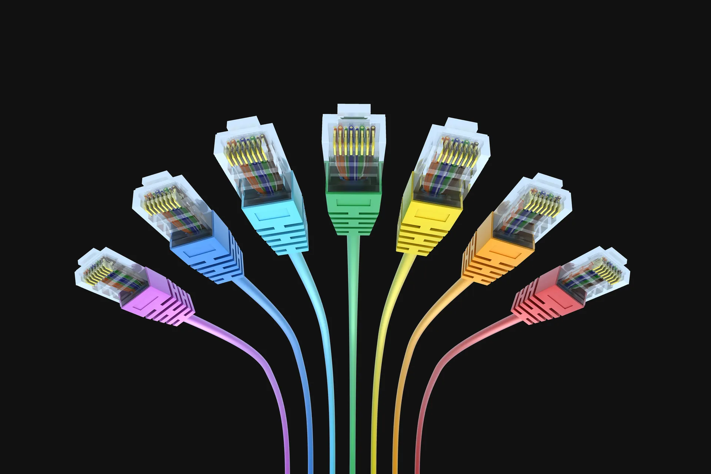

- [Introduction Network](#introduction-network)
  - [Overview and benefit of computer network](#overview-and-benefit-of-computer-network)
    - [What is a Network?](#what-is-a-network)
    - [Some Basic Networking Rules](#some-basic-networking-rules)
    - [Type of Computer Networks (by size)](#type-of-computer-networks-by-size)
      - [Personal Area Network (PAN)](#personal-area-network-pan)
      - [Local Area Network (LAN)](#local-area-network-lan)
      - [Wireless Local Area Network (WLAN)](#wireless-local-area-network-wlan)
      - [Campus Area Network (CAN)](#campus-area-network-can)
      - [Metropolitan Area Network (MAN)](#metropolitan-area-network-man)
      - [Wide Area Network (WAN)](#wide-area-network-wan)
    - [Network Architecture](#network-architecture)
      - [Peer-to-Peer](#peer-to-peer)
      - [Client-Server](#client-server)
      - [Peer-to-Peer vs Client-Server Network](#peer-to-peer-vs-client-server-network)
  - [Introduction to Computer Networking Protocols](#introduction-to-computer-networking-protocols)
    - [What is a Protocol?](#what-is-a-protocol)
    - [Physical and Logical Protocols](#physical-and-logical-protocols)
      - [Physical Protocols](#physical-protocols)
      - [Logical Protocols](#logical-protocols)
  - [The OSI Model](#the-osi-model)
    - [What is the OSI Model?](#what-is-the-osi-model)
    - [The 7 Layers of the OSI Model](#the-7-layers-of-the-osi-model)
    - [How Data Travels Through the OSI Model](#how-data-travels-through-the-osi-model)
  - [The TCP/IP Model](#the-tcpip-model)
    - [What is the TCP/IP Model?](#what-is-the-tcpip-model)
    - [The Four Layers of TCP/IP](#the-four-layers-of-tcpip)
    - [TCP/IP vs. OSI Model](#tcpip-vs-osi-model)
    - [Important Protocol Examples](#important-protocol-examples)
  - [Duplex Communication](#duplex-communication)
  - [Network Transmission Types](#network-transmission-types)
    - [Unicast](#unicast)
    - [Multicast](#multicast)
    - [Broadcast](#broadcast)
  - [Wired Network Topologies](#wired-network-topologies)
    - [Ring Topology](#ring-topology)
    - [Star Topology](#star-topology)
    - [Mesh Topology](#mesh-topology)
  - [Wireless Network Topologies](#wireless-network-topologies)
    - [Ad hoc](#ad-hoc)
    - [Infrastructure](#infrastructure)
    - [Mesh](#mesh)
- [Physical - OSI layer 1 - Network Access - TCP/IP Layer 1](#physical---osi-layer-1---network-access---tcpip-layer-1)
  - [Ethernet](#ethernet)
- [Data link - OSI layer 2 - Network Access - TCP/IP Layer 1](#data-link---osi-layer-2---network-access---tcpip-layer-1)
  - [MAC Addresses - Media Access Control (MAC)](#mac-addresses---media-access-control-mac)
    - [What is a MAC Address?](#what-is-a-mac-address)
    - [MAC Address vs. MAC Address Spoofing](#mac-address-vs-mac-address-spoofing)
    - [MAC Address Format](#mac-address-format)
      - [OUI — Organizationally Unique Identifier](#oui--organizationally-unique-identifier)
      - [Individual identifier](#individual-identifier)
- [Network - OSI layer 3 - Internet - TCP/IP Layer 2](#network---osi-layer-3---internet---tcpip-layer-2)
  - [IP Address](#ip-address)
    - [What is an IP Address?](#what-is-an-ip-address)
    - [IP Address vs MAC Address](#ip-address-vs-mac-address)
    - [Internet Protocol version 4 - IPv4](#internet-protocol-version-4---ipv4)
    - [Internet Protocol version 6 - IPv6](#internet-protocol-version-6---ipv6)

# Introduction Network

## Overview and benefit of computer network

### What is a Network?

- It is composed of two main aspects:
  - Physical Connection (wires, cables, wireless media)
  - Logical Connection (data transporting across the physical media)

### Some Basic Networking Rules

- The computers in a network must use the same procedures for sending and receiving data. We call these communication protocols.
- Data must be delivered uncorrupted. If it is corrupted, it’s useless. (There are Exceptions)
- Computers in a network must be capable of determining the origin and destination of a piece of information, i.e., its IP and Mac Address.

### Type of Computer Networks (by size)

- Personal Area Network (PAN)
- Local Area Network (LAN)
- Wireless Local Area Network (WLAN)
- Campus Area Network (CAN)
- Metropolitan Area Network (MAN)
- Wide Area Network (WAN)

#### Personal Area Network (PAN)

- Ultra-small networks used for personal use to share
  data from one device to another.
- Examples: Smart Phone to Laptop, Smart Watch to Smart Phone, Heart Rate Monitor to Smart Phone

#### Local Area Network (LAN)

- A computer network within a small geographical area, such as a single room, building or group of buildings.
- Examples: Home Network, Small Business or Office Network

#### Wireless Local Area Network (WLAN)

- A LAN that’s dependent on wireless connectivity or one that extends a traditional wired LAN to a wireless LAN.
- Most home networks are WLANs.

#### Campus Area Network (CAN)

- A computer network of multiple interconnected LANs in a limited geographical area, such as a corporate business park, government agency, or university campus.
- Typically owned or used by a single entity.

#### Metropolitan Area Network (MAN)

- A computer network that interconnects users with computer resources in a city.
- Larger than a campus area network, but smaller than a wide area network.

#### Wide Area Network (WAN)

- A computer network that extends over a large geographical distance, typically multiple cities, states, or countries.
- WANs connect geographically distant LANs.
- Examples: The Internet, Corporate Offices in Different States

### Network Architecture

#### Peer-to-Peer

- All computers on the network are peers
  - No dedicated servers
  - There’s no centralized control over shared resources
- Any device can share its resources as it pleases
- All computers can act as either a client or a server
- Easy to set-up, and common in homes and small businesse

#### Client-Server

- The network is composed of client and servers
  - Servers provide resources
  - Clients receive resources
- Servers provide centralized control over network resources (files, printers, etc.)
- Centralizes user accounts, security, and access controls to simplify network administration
- More difficult to setup and requires an IT administrator

#### Peer-to-Peer vs Client-Server Network

| Criteria                 | Peer-to-Peer (P2P)                           | Client-Server                                           |
| ------------------------ | -------------------------------------------- | ------------------------------------------------------- |
| Computer roles           | All computers are peers                      | Computers are divided into clients and servers          |
| Dedicated servers        | No dedicated servers                         | Dedicated servers                                       |
| Control over resources   | No centralized control                       | Centralized control                                     |
| Resource sharing         | Each device shares resources as it chooses   | Servers provide resources                               |
| Device function          | Any computer can act as a client or a server | Clients request, servers provide                        |
| Resource management      | Decentralized                                | Centralized                                             |
| User accounts & security | No centralized management                    | Centralized user accounts, security, and access control |
| Setup complexity         | Easy to set up                               | More difficult to set up                                |
| IT administration        | Not required                                 | Requires an IT administrator                            |
| Typical usage            | Homes and small businesses                   | Medium and large organizations                          |

## Introduction to Computer Networking Protocols

### What is a Protocol?

- A protocol is essentially a set of rules that defines how systems communicate and exchange data.
- In computer networking, network protocols are rules that govern how devices on a network exchange data and enable effective communication.
- Examples:
  - Email protocols => sending and receiving emails
    - POP3, SMTP, IMAP
  - File transfer protocols => sending and receiving files
    - FTP
  - Web protocols => communicating with web servers 
    - HTTP, HTTPS

### Physical and Logical Protocols

- A computer network has two main aspects:
  - Physical aspect
  - Logical aspect
- Therefore, networking protocols can also be divided into

#### Physical Protocols

- Physical protocols deal with the physical characteristics of network communication, such as:
  - Network transmission media
  - Cables and wiring
  - Connectors
  - RJ-45 ports
  - Electrical signals
  - Voltage levels on the wire


#### Logical Protocols

- Logical protocols deal with software and communication rules.
- They determine:
  - How data is sent
  - When data is sent
  - How data is received
  - How computers communicate using the underlying physical network

## The OSI Model

### What is the OSI Model?

- OSI stands for Open Systems Interconnection.
- The OSI model is a conceptual reference model that explains how data flows through a network from a source device to a destination device.
- Important:
  - OSI is not actually implemented as the networking architecture used in the real world.
  - TCP/IP is the practical networking model/protocol suite used in real networks.
  - However, OSI is widely used for learning, troubleshooting, and discussing networking concepts.

### The 7 Layers of the OSI Model

**Memorize:** _Please Do Not Throw Sausage Pizza Away_

| Layer No. | Mnemonic    | Layer Name   | Data Unit | Common Protocols                              | Typical Devices                   |
| --------- | ----------- | ------------ | --------- | --------------------------------------------- | --------------------------------- |
| 7         |  A – Away | Application  | Data      | HTTP, HTTPS, FTP, SMTP, POP3, IMAP, DNS, SNMP | PC, Server, Proxy Server          |
| 6         | P – Pizza   | Presentation | Data      | SSL/TLS, JPEG, MPEG, ASCII                    | PC, Server                        |
| 5         | S – Sausage | Session      | Data      | NetBIOS Session, RPC, PPTP                    | PC, Server                        |
| 4         | T – Throw   | Transport    | Segment   | TCP, UDP                                      | Firewall, Load Balancer (Layer 4) |
| 3         | N – Not     | Network      | Packet    | IP, ICMP, IPsec, RIP, OSPF, BGP               | Router, Layer 3 Switch            |
| 2         | D – Do      | Data Link    | Frame     | Ethernet (802.3), ARP, PPP, VLAN (802.1Q)     | Switch, Bridge, NIC               |
| 1         | P – Please    | Physical     | Bit       | Physical standards (UTP, Fiber)               | Hub, Repeater, Cable              |

### How Data Travels Through the OSI Model

- Sender: The data starts at the top

```
  Application
     ↓
  Presentation
     ↓
  Session
     ↓
  Transport
     ↓
  Network
     ↓
  Data Link
     ↓
  Physical
     ↓
   Network
```

- Receiver: Receives the transmission and processes it in the opposite direction

```
   Network
      ↓
  Physical
      ↓
  Data Link
      ↓
  Network
      ↓
  Transport
      ↓
  Session
      ↓
  Presentation
      ↓
  Application
```


## The TCP/IP Model

### What is the TCP/IP Model?

- TCP/IP is the most widely used networking protocol suite today and forms the foundation of the Internet.
- Unlike the OSI model:
  - OSI => conceptual/reference model, never implemented as a real-world networking architecture.
  - TCP/IP => actually implemented and widely used in real network

### The Four Layers of TCP/IP

| Layer No. | TCP/IP Layer Name | OSI Mapping   | Data Unit   | Common Protocols                              | Typical Devices                   |
| --------- | ----------------- | ------------- | ----------- | --------------------------------------------- | --------------------------------- |
| 4         | Application       | OSI Layer 7–5 | Data        | HTTP, HTTPS, FTP, SMTP, POP3, IMAP, DNS, SNMP | PC, Server, Proxy Server          |
| 3         | Transport         | OSI Layer 4   | Segment     | TCP, UDP                                      | Firewall, Load Balancer (Layer 4) |
| 2         | Internet          | OSI Layer 3   | Packet      | IP, ICMP, IPsec, ARP                          | Router, Layer 3 Switch            |
| 1         | Network Access    | OSI Layer 2–1 | Frame / Bit | Ethernet, Wi-Fi (802.11), PPP                 | Switch, NIC, Hub, Cable           |

### TCP/IP vs. OSI Model

- TCP/IP didn't completely change how networking functions work.
- Instead, it simplified the OSI model by combining related functions into fewer layers

| TCP/IP                | OSI                                  |
| --------------------- | ------------------------------------ |
| **Application**       | Application + Presentation + Session |
| **Transport**         | Transport                            |
| **Internet**          | Network                              |
| **Network Interface** | Data Link + Physical                 |

```
TCP/IP Model                  OSI Model

Application        ───────>   Application
                              Presentation
                              Session

Transport          ───────>   Transport

Internet           ───────>   Network

Network Interface  ───────>   Data Link
                              Physical
```

### Important Protocol Examples

| Layer                       | Protocol / Technology | Purpose                                                              |
| --------------------------- | --------------------- | -------------------------------------------------------------------- |
| **Application Layer**       | **HTTP/HTTPS**        | Web communication                                                    |
| **Application Layer**       | **FTP**               | File transfer                                                        |
| **Application Layer**       | **SMTP**              | Sending email                                                        |
| **Application Layer**       | **POP3**              | Receiving email                                                      |
| **Transport Layer**         | **TCP**               | Reliable transport of data                                           |
| **Transport Layer**         | **UDP**               | Fast, connectionless transport of data                               |
| **Internet Layer**          | **IP**                | Logical addressing and routing                                       |
| **Internet Layer**          | **ARP**               | Resolving IP addresses to MAC addresses in IPv4 networks             |
| **Network Interface Layer** | **Ethernet**          | Accessing the network and transmitting data over Ethernet networks   |
| **Network Interface Layer** | **Token Ring**        | Accessing the network and transmitting data over Token Ring networks |


## Duplex Communication

- Network communication will occur in either full or half duplex mode:
  - Half Duplex: Can send and receive data, but not at the same time.
  - Full Duplex: Can send and receive data simultaneously.

## Network Transmission Types

### Unicast

- One-to-One


### Multicast

- One-to-Many


### Broadcast

- One-to-All


## Wired Network Topologies

### Ring Topology

- All devices are connected in a circular fashion, with each device (node) linked to two others.
- Data travels from node to node, with each device handling and regenerating the signal, acting as a repeater.
- WAN technologies like SONET/SDH use dual ring topologies for redundancy, where the two rings send data in opposite directions (counterrotating), so if one path or node fails, data can travel the other way, ensuring continuous service.
- This redundancy provides high availability and rapid recovery from failures, making ring topologies popular in high-speed carrier networks.


### Star Topology

- All devices are connected to a central connecting device, which is almost always a
  switch in modern networks.
- Devices send data to the switch, which forwards it only to the appropriate destination
  device.
- Star topology is the standard for nearly all modern LANs, from home networks to
  enterprise environments.
- While the central switch is a single point of failure, modern networks often use redundant
  switches and connections to address this.


### Mesh Topology

- Devices are connected to multiple other devices, creating redundant paths for data.
  There are two types:
- Full Mesh: Each device connects to every other device (maximum redundancy, rarely
  used due to high cost)
- Partial Mesh: Devices connect to some, but not all, other devices (balances redundancy
  with cost)
- Commonly used in WANs and for critical network infrastructure where reliability is
  essential.
- Modern networks typically use a partial mesh for core components only.


## Wireless Network Topologies

### Ad hoc

- Peer-to-peer (P2P) wireless network where no wireless access point (WAP) infrastructure exits.
- The devices communicate directly with one another.
- Personal area networks (PANs) are a common example of Ad hoc wireless networks.


### Infrastructure

- Wireless network that uses a wireless access point (WAP) as its central connecting
  device.
- Infrastructure wireless networks (WLANs) are commonly used in homes and small offices.


### Mesh

- Just like a wired mesh design, wireless mesh networks utilize several wireless access points (nodes) to create a robust wireless network that is:
  - Scalable
  - Self-Healing
  - Reliable (redundancy)
- Common in larger homes and businesses


# Physical - OSI layer 1 - Network Access - TCP/IP Layer 1

## Ethernet



- The most popular networking technology in the world!
- Refers to a family of standards that define the physical and logical aspects of the world's most popular type of LAN.
- The standard communications protocol for building a local area network (LAN).

# Data link - OSI layer 2 - Network Access - TCP/IP Layer 1

## MAC Addresses - Media Access Control (MAC)

### What is a MAC Address?

- MAC stands for Media Access Control.
- A MAC address is the physical/hardware address associated with a device's **network adapter**.
- A network adapter is also called:
  - Network Interface Card (NIC)
  - Network Adapter
  - These terms are generally interchangeable


### MAC Address vs. MAC Address Spoofing

- Traditionally, a MAC address is assigned to the network interface hardware.
- It is associated with the hardware rather than being simply an IP address configured by the user.
- However, an operating system can perform MAC address spoofing.
  - The hardware's original MAC address isn't physically changed. Instead, the operating system is instructed to use a different MAC address.
  - MAC spoofing is also relevant in cybersecurity and network testing.

### MAC Address Format

- A MAC address is: 48 bits - 6 bytes
  - Usually represented in hexadecimal
  - Example: 00:1A:2B:3C:4D:5E

```
00 : 1A : 2B : 3C : 4D : 5E
 └───────┘   └───────────────┘
   3 bytes         3 bytes
  (24 bits)       (24 bits)
    |                 |
    ▼                 ▼
   OUI       Individual identifier
```

#### OUI — Organizationally Unique Identifier

- OUI stands for Organizationally Unique Identifier.
- The OUI identifies the organization/manufacturer associated with the network interface.
- OUIs are assigned through the IEEE
  - Institute of Electrical and Electronics Engineers

#### Individual identifier

- The remaining 24 bits can be used to identify individual network interfaces under that OUI.
- 2²⁴ ~16.7 Million Unique Addresses

# Network - OSI layer 3 - Internet - TCP/IP Layer 2

## IP Address

### What is an IP Address?

- IP stands for Internet Protocol.
- An IP address is a logical address used to identify a device on a network.
- Unlike a MAC address, an IP address is configured by the operating system/network configuration.
  - It can be assigned in two main ways:
    - Automatically -> using DHCP
    - Manually -> Manually configured. The administrator enters the IP address.
- Example
  - Pv4 - 192.168.1.10
  - IPv6 - 2001:db8::1

### IP Address vs MAC Address

| **Category**                 | **IP Address**                                                                                         | **MAC Address**                                                                                              |
| ---------------------------- | ------------------------------------------------------------------------------------------------------ | ------------------------------------------------------------------------------------------------------------ |
| **Definition**               | A **logical address**                                                                                  | A **physical/hardware address** associated with a network interface card (NIC)                               |
| **OSI Layer**                | **Layer 3 — Network Layer**                                                                            | **Layer 2 — Data Link Layer**                                                                                |
| **Main Purpose**             | Used for **network-to-network communication**, especially when traffic needs to travel through routers | Used primarily for **communication within a local network (LAN)**                                            |
| **Communication**            | **Network → Network**                                                                                  | **Device/interface → Device/interface within a local network**                                               |
| **Main Network Device**      | **Router**                                                                                             | **Switch**                                                                                                   |
| **Assignment**               | **Static** or **Dynamic**                                                                              | Associated with the **NIC hardware**                                                                         |
| **Static Assignment**        | Manually configured by a network administrator                                                         | Normally associated with the network interface hardware                                                      |
| **Dynamic Assignment**       | Automatically assigned by a **DHCP server**                                                            | Not normally assigned by DHCP                                                                                |
| **Can be spoofed?**          | Yes                                                                                                    | Yes — the OS can spoof a MAC address, but this does not physically change the address stored by the hardware |
| **Example**                  | `192.168.1.10`                                                                                         | `00:1A:2B:3C:4D:5E`                                                                                          |
| **Example of communication** | Your home network → Router → Internet → Gmail network → Gmail server                                   | PC → Switch → PC / Printer                                                                                   |
| **Key concept**              | **Routing**                                                                                            | **Switching**                                                                                                |


### Internet Protocol version 4 - IPv4

### Internet Protocol version 6 - IPv6
